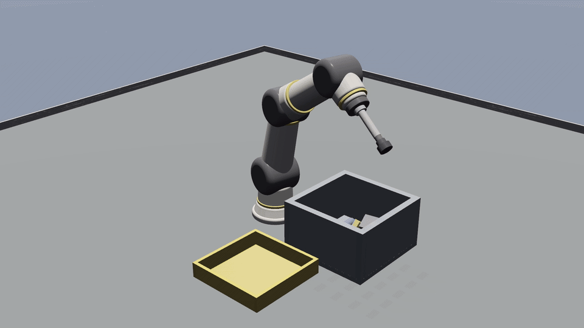

# OmniSim

**The simulator you can talk to.** Describe a scene and an agent builds it; describe a behaviour and
an agent wires the controller. Everything runs over plain HTTP/JSON, so the agent loads the world,
steps physics, takes a screenshot and hot-reloads — without leaving the conversation.

Built by agents, for agents: the HTTP harness, the Newton physics integration, the cloth and
soft-body stack, the RL pipeline and the ROS 2 sidecar were written by an AI agent under human
direction. Physics is [Newton](https://github.com/newton-physics/newton), the only backend.
Apache-2.0, with a first-party [MCP server](packages/omnisim-mcp/) for Claude Code and Cursor,
and a [ROS 2 sidecar](packages/omnisim-ros2/) speaking the `simulation_interfaces` standard.

[**Join the public beta**](BETA.md) · [Builder challenge](BUILDERS.md) · [For research labs](LABS.md) · [Latest release](https://github.com/omnilink-tech/omnisim/releases/latest) ·
[Demos](DEMOS.md) · [Agent entry point](AGENTS.md) · [Protocol](PROTOCOL.md)

[](docs/media/videos/omniarm6_universal_pick.mp4)

*The OmniArm 6 Universal Pick demo uses a top-down depth camera to choose grasp
points on arbitrary, previously unmodelled shapes and move them from the bin to
the tote. Normal picks use no object registry, classifier or authored pick
anchors; the controller documents its limited recovery and suction-bookkeeping
paths. [Play the MP4](docs/media/videos/omniarm6_universal_pick.mp4).*

> **Public beta:** we are looking for the first ten external developers willing
> to spend 20 minutes installing OmniSim, running one demo, and reporting the
> first confusing or broken step. Windows has the first downloadable package;
> Linux is a source build; macOS is not supported.
> [Take the 20-minute challenge →](BETA.md)

---

## Run a real robot demo

Three minutes on Windows. About half an hour on Linux, because you build it.

1. **Get OmniSim.**
   - **Windows 10/11** — install the asset from the
     [latest release](https://github.com/omnilink-tech/omnisim/releases/latest)
     (~600 MB). This is the only prebuilt package.
   - **Linux** — Ubuntu 24.04 or 22.04, built from source:
     `bash scripts/install/linux_bootstrap.sh`. Budget 25–45 minutes; most of it
     is the compile. Details: [quickstart](docs/developer/quickstart.md).
     On 22.04 the bootstrap installs Python 3.12 (deadsnakes) and the engine
     embeds it — the system 3.10 cannot run `newton`, and the build refuses to
     link it rather than produce a simulator where nothing moves.
   - **macOS** — not supported. There is no package, no verified build, and
     Newton physics is unverified. Use Windows or Ubuntu 24.04.

2. **Check the install.** Open a terminal in the OmniSim directory:

   ```bash
   python -m omnisim doctor
   ```

   It ends on a VERDICT line, and exits non-zero if the install cannot run —
   most usefully when the Newton runtime is absent, which is not a degraded
   mode but an install where nothing ever falls. On Windows without Python,
   run `omnisim.bat doctor` instead: it uses the interpreter in the package.

3. **See a robot move.**

   ```bash
   python -m omnisim demo
   ```

   That is the real friction-grasp demo above. `python -m omnisim demos` lists
   all of them (52 as of 2026-09-01), by category — the launcher's `demos.json`
   is the live catalogue.

Then choose the shortest route to your own work:

- **Coding agent or MCP client:** read [AGENTS.md](AGENTS.md). Opening this
  directory in Claude Code registers the first-party
  [OmniSim MCP server](packages/omnisim-mcp/) automatically — the checked-in
  `.mcp.json` does it, with no install. Start the harness it proxies with
  `python -m omnisim harness`. There is also a packaged
  [OmniSim Codex plugin](plugins/omnisim/).
- **ROS 2:** start with the verified
  [`ros2_control` Husky diff-drive example](packages/omnisim-ros2/README.md#tier-3-ros2_control-on-the-husky).
- **Your robot or research task:** use the [URDF/STEP workflows](LABS.md#good-first-pilots),
  or ask OmniLink to port one bounded, measurable pilot.

If any step is confusing or fails, that is exactly what the
[public beta](BETA.md) is designed to capture.

---

## How OmniSim compares

Every OmniSim cell is **measured by us** and is reproducible from this repo. Every row names the
machines that produced it and we never average across them: the §3 throughput rows are **three**
machines, the §3 workload rows and the capability matrix are **two**, and a row that is still one
machine says so in the row. The machines are a **laptop RTX 3060 (6 GB), Ryzen 16-thread, Windows
11** (`9722d23d12a3`), an **RTX A4500 / AMD EPYC 7352, Ubuntu 22.04** (`8ab788c4c833`), and RunPod
**RTX 4000 Ada** (`c72ce5632c81`) and **RTX 4090** (`b5dadd645b1f`). Competitor cells are **their own
published documentation**, dated and linked; we did not measure their engines. Where we lose is in
[its own section](#what-omnisim-is-worse-at).

### 1. Agent-native

|  | **OmniSim** | Gazebo Jetty | Isaac Sim 6.0.1 |
|---|---|---|---|
| First-party HTTP/JSON scene API | **38 endpoints** | none | none |
| Typed external control | 38 harness + 15 capture verbs, **plus ROS 2 `simulation_interfaces` (15 svc + 1 action) and a `ros2_control` `SystemInterface`** | ROS 2 `simulation_interfaces` (18 svc + 1 action) + `ros2_control` | ROS 2 + `ros2_control`, **plus raw Python over TCP :8226** |
| First-party MCP server | **18 tools**, stdio, zero deps | none | **5 tools — docs search; none touch a running sim** |
| Structured load diagnostics | **50+ codes** (open enum; `GET /capabilities` serves the live set) | — | — |
| Typed runtime events | **10**, with drop counters | — | — |
| `AGENTS.md` at repo root | **701 lines** | none | **yes, + 25 `SKILL.md` skills** |

### 2. Performance and resources

|  | **OmniSim** | Gazebo Jetty | Isaac Sim 6.0.1 |
|---|---|---|---|
| Minimum GPU | **none — the default solver is CPU** | OpenGL >3.3 | **GeForce RTX 4080** |
| Minimum VRAM | n/a on the CPU path | not published | **16 GB** |
| Datacenter GPUs | fine | fine | **A100 / H100 [unsupported](https://docs.isaacsim.omniverse.nvidia.com/latest/installation/requirements.html)** |
| Installed size | **7.7 MB binary + 647 MB runtime** — Windows beta package published; Linux is source-build | not published | **13.02 GB + 80.17 GB assets ≈ 93 GB** |
| Container image | CUDA **training** image on [GHCR](https://github.com/omnilink-tech/omnisim/pkgs/container/omnisim-train); a CPU **runtime** image ([`docker/`](docker/README.md)) builds and smoke-tests but is **not on the registry yet** | yes | **10.7 GB** |
| GPU physics | **yes** (`mujoco_warp`) | **none**, absent from the roadmap | yes |
| Batched parallel envs | **yes** | process-level only | yes |

### 3. What that hardware actually runs

Every row says which machines produced it, listed separately and never averaged. Throughput:
**three** machines ([campaign](docs/benchmarks/omnibench-multimachine-2026-08-17.md), 2026-08-17):

| GPU | GPU-batched physics @4096 | Full in-engine PPO @4096 | overhead vs raw MuJoCo-Warp |
|---|---|---|---|
| **RTX 3060 Laptop, 6 GB** (`9722d23d12a3`) | **165,369 env-steps/s** | **98,136 env-steps/s** | 1.27× @256 · 1.39× @4096 |
| RTX 4000 Ada, 20 GB (`c72ce5632c81`) | 280,820 | 201,850 | 1.26× @256 · 1.44× @4096 |
| RTX 4090, 24 GB (`b5dadd645b1f`) | 535,377 | 499,734 | 1.24× @256 · 1.40× @4096 |

Everything else, with its coverage stated per row
([campaign](docs/benchmarks/lane4-multimachine-2026-08-17.md), 2026-08-17):

| Workload | Measured | measured on |
|---|---|---|
| Rigid bodies at real time, CPU solver | **200 bodies @ 1.45×** (3060 laptop, Ryzen) and **@ 1.35×** (RTX A4500 pod, EPYC 7352) — ceiling not reached on either | **2 machines** |
| Overhead vs raw MuJoCo-Warp, identical model, both CUDA-graphed | **1.24–1.44×**, and the ratio tracks batch size, not GPU | **3 machines** |
| With **no CUDA device visible to the process** | trajectory **bit-identical** to the GPU-visible run, on both | **2 machines** |
| Cloth, 289-particle drape, as shipped | **2.85 ms/step (2.81×)** laptop · **2.36 ms/step (3.39×)** A4500 | **2 machines** |
| Cloth, same drape at 2 VBD iterations | 1.28 ms/step (6.2×) laptop · 0.60 ms/step (13.2×) A4500 | **2 machines** |
| Cloth **forced onto the CPU** | 51.9 ms/step — **0.15× real time**, so deformables are a GPU feature | ⚠ **1 machine** (laptop) |
| Silent constraint-buffer overflow, `mujoco_warp` | **16 driven rovers exceed the 256-row default** (peak 336 / 328) with a clean log and exit 0 | **2 machines** |
| Unit | 1 env-step = one 16 ms control step = 8 physics substeps | — |
| RAM / VRAM footprint | **not measured — we publish no figure** | — |

### 4. Beyond rigid bodies — cloth, soft bodies, cables

|  | **OmniSim** | Gazebo Jetty | Isaac Sim 6.0 |
|---|---|---|---|
| Cloth | **yes** — Newton VBD; a T-shirt grasp measured against a negative control | **none** | particle cloth **removed → error stubs**; replacement is **beta** |
| FEM soft bodies | **yes** — tet-`SoftBody`, two-way soft→rigid coupling measured | **none** exposed | new schema (old removed) |
| Cables / rods | Newton ships it; **no OmniSim node yet** | none | Newton VBD only, not PhysX |
| Granular | CUDA kernel, 100k particles @ 4.50 ms/step — **robot↔particle coupling currently dead** | none | GPU PBD; **no CPU support** |
| Particles | via cloth / soft / granular | **visual + lidar scattering only** | GPU PBD; schema *"not finalized"* |
| Fluids | **none** (removed with ODE) | analytic drag only | PBD position-based |

The grasp numbers behind that first row — tracking error **−1.50 mm** on a 616-particle T-shirt
against **−173.06 mm** for a negative control whose jaws never close, corroborated by a second
instrument, plus the hem-edge target that **misses** and is reported as a miss — are in
[cloth-simulation.md](docs/developer/cloth-simulation.md), with the three disclosures that travel
with them: the fabric is **pinned**, so these are tracking and not load-bearing numbers; self-contact
must be off to grasp and on to drape; and the composed **fold** is not demonstrated.

### 5. Newton maturity

|  | **OmniSim** | Isaac Sim 6.0.1 | Isaac Lab |
|---|---|---|---|
| Newton version | **1.5.0** | **1.2.1** | 3.0 beta |
| Solvers driven | **2** (MuJoCo + VBD) | **1 of 8** (MJWarp) | primarily MJWarp |
| Status | **only backend, shipping** | *"experimental"* | **beta since 2026-03-17, no GA** |

### 6. Licence

|  | Engine licence | Runtime restrictions |
|---|---|---|
| **OmniSim** | **Apache-2.0** | none |
| Gazebo | Apache-2.0 | none |
| Isaac Lab | BSD-3-Clause | inherits Isaac Sim's when used with it |
| Isaac Sim | Apache-2.0 *source only* | NVIDIA ASML: **no redistribution, no derivative works**, use confined to *"systems with NVIDIA GPUs"* |

Caveats, sources and the claim-by-claim comparison with every entry marked verified / unaudited /
vendor-claim: [docs/developer/simulator-comparison.md](docs/developer/simulator-comparison.md).

## What OmniSim is worse at

- **ROS 2 support is new and incomplete.** OmniSim implements the ROS 2
  [`simulation_interfaces`](packages/omnisim-ros2/) standard plus `/clock`, `/tf`, `JointState`,
  `/odom`, `cmd_vel`, sensor topics (`Imu`, `LaserScan`, GPS) and a **`ros2_control`
  `SystemInterface`** — but that last one is verified for **velocity-commanded bases only**
  (`diff_drive_controller` on the Husky). **MoveIt is still out of reach**, because OmniSim's arm
  bridge treats a joint command as a goal and answers `409 busy` to a setpoint arriving while the
  previous one is still interpolating — a trajectory would land in pieces. **Nav2 has never been
  brought up against OmniSim**, and OmniSim is not in the `ros2_control` simulator registry. Sensor
  coverage is partial by measurement, not by omission: OmniSim's `Gyro` and `Accelerometer` produce
  no usable data, so `Imu` ships a real orientation and declares those two components absent, and no
  robot in the tree has a camera. For a lab whose stack *is* ROS 2 end to end, Gazebo remains better
  integrated.
- **Not photoreal.** Isaac Sim's RTX renderer is a different class. Ours is wgpu-native (Vulkan / D3D12 / Metal): a real-time raster stack whose global illumination is *baked* — an off-frame path trace into an irradiance probe volume, not per-frame ray tracing.
- **Sim-to-real is unproven** — zero physical-robot transfer.
- **No free-standing humanoid walk** — every G1 result uses a weight-bearing balance harness.
  Quadrupeds carry none.
- **Newton is young and we removed our fallback.** macOS is untested, so it has no verified physics.
- **Single-GPU training only.** No multi-GPU or multi-node; Isaac Lab publishes a 16-GPU ladder.
  Our figures are one GPU, and every number above says which one.
- **95.7% of measured capabilities work** (51 probes as of 2026-09-01 round 3 -- eight rows flipped to works in one day, measured: IMU carrier, propeller inflow, ball probe, limit-less servo promotion, cloth/FEM/granular particle readback, connector weld, runtime deletion via rebuild; the
  45-probe set as it stood on 2026-08-17 also ran on a **second machine** — 43 of 45 verdicts
  agreed, and both disagreements are attributed in the
  [campaign](docs/benchmarks/lane4-multimachine-2026-08-17.md), neither to the hardware).
  Restitution is unimplemented, and runtime scene mutation is non-physical in both directions *by
  default*: deleted nodes keep colliding, and spawned nodes are never registered with the solver at
  all (since 2026-09-01 an opt-in mid-run physics rebuild — `POST /sim/rebuild_physics`, 97–267 ms
  measured — fixes both, refused on deformable worlds and dropping engaged welds).
  Compound colliders drop all but the first child by default. A motorised `BallJoint` was measured
  not to actuate, but a 2026-09-01 probe review found that measurement could not have detected
  actuation — unproven either way pending re-measurement (its `Hinge2Joint` sibling does actuate).
  [Capability matrix](docs/benchmarks/lane4-capability-matrix.md) · [CHANGELOG](CHANGELOG.md).
- **A `mujoco_warp` scene silently drops constraint rows past 256.** Measured on both machines:
  16 driven four-wheeled rovers peak at 336 and 328 rows against a cap that does not grow, with a
  clean log and exit code 0. Raise `WorldInfo.newtonNjmax` before you build a fleet.
- **Smaller ecosystem** than Gazebo — fewer robots, fewer worlds, no package index.

---

## Get started

The three-minute path above is the fastest start. Contributors who want a
source build can clone it, open the folder in a coding agent, and ask:

```text
Set up OmniSim from this fresh clone — install whatever the toolchain needs, build it,
and then launch the warehouse Husky demo so I can watch it.
```

The agent follows [AGENTS.md](AGENTS.md) (auto-loaded) and the
[quickstart](docs/developer/quickstart.md). First build is 5–25 minutes. By hand instead:
`build_omni.bat` on Windows, `bash scripts/install/linux_bootstrap.sh` on Linux.

**Then run `python -m omnisim doctor`** — it reports the ground truth about your clone. ⚠️ Newton is
the only backend, so a build without its runtime has **no physics at all** and otherwise fails
quietly.

| | Windows 10/11 | Linux | macOS |
|---|---|---|---|
| Build from source | ✅ documented | ✅ scripted | ⚠️ untested |
| Simulator, URDF import, harness, capture | ✅ | ✅ verified | ⚠️ untested |
| **Newton physics** (the only physics) | ✅ CPU default; GPU needs CUDA | ✅ wheels in the **system** `python3` | ⚠️ **untested — no fallback exists** |
| RL training + locomotion demos | ✅ | ✅ | ❌ |

## What you can ask for

```text
"Launch the warehouse demo."
"Generate a Mars world with a 5-Husky fleet and run it headless for 30 seconds."
"Add three red cylinders in front of the Husky and make it avoid them."
"Wire a Jackal on a flat platform, expose it on HTTP, and drive it forward 2 m."
"Why isn't the camera seeing the red cylinder?"
```

The agent builds the world, edits controllers, runs the simulator, and verifies its own work through
the [validation harness](scripts/harness/). For runtime control of robots in a live scene, point
[OmniLink agents](https://www.omnilink-agents.com) at the per-robot HTTP bridges
([protocol](PROTOCOL.md)).

## Robots

| Brand | Models |
|---|---|
| **OmniSim** | OmniArm 6 cobot · OmniArm 7 cobot · OmniTug 500 warehouse tug |
| **Unitree** | Go2 · B2 quadrupeds · G1 · H1 humanoids |
| **OmniLink** | OmniQuad quadruped |
| **Clearpath** | Husky · Jackal |
| **Universal Robots** | UR3e · UR5e · UR10e |
| **Husarion** | Rosbot · Rosbot XL |
| **Robotis** | TurtleBot3 |
| **DJI** | Mavic 2 Pro |

Per-robot status is in [DEMOS.md](DEMOS.md). One caveat on OmniSim's own reference robots:
**OmniTug 500** is a visual-only prop with no collider, so it is positioned kinematically and does
not participate in contact. **OmniArm 6** and **OmniArm 7** are fully simulated, and OmniArm 6 is
verified holding pose under gravity.

## Teaching robots to move

Legged policies are made by **Shadowing** — train against a reference trajectory verified feasible
*before* learning starts, in-engine, so train and deploy share one solver. Fifteen skills ship across
G1, H1, Go2 and OmniQuad; **BATON** composes them into sequences.

```bash
python -m omnisim policy list                  # the catalogue
python -m omnisim policy sequence box_delivery # run a BATON demo
```

⚠️ **Our humanoid demos run on a weight-bearing balance harness and are not free-standing walks.**
Unitree's own policies re-hosted unchanged in OmniSim *do* walk free-standing, so the engine carries
it — training a policy that does is the open problem.

[Shadowing](docs/developer/shadowing.md) · [Skill Library](docs/developer/skill-library.md) ·
[canonical RL status](docs/developer/rl-current-state.md)

## Docs

| Audience | Start with |
|---|---|
| Installing it (per platform, prerequisites) | [Installation procedure](docs/guide/installation-procedure.md) · [System requirements](docs/guide/system-requirements.md) |
| AI coding agent in this repo | [AGENTS.md](AGENTS.md) |
| Picking a demo | [DEMOS.md](DEMOS.md) |
| First-time human contributor | [Developer Quickstart](docs/developer/quickstart.md) |
| Engine developer | [docs/developer/](docs/developer/) |
| World author | [Simulation Authoring for Coding Agents](docs/developer/simulation-authoring-for-coding-agents.md) |
| Driving OmniSim from outside | [PROTOCOL.md](PROTOCOL.md) |
| ROS 2 user | [packages/omnisim-ros2/](packages/omnisim-ros2/) · [the ROS 2 story](docs/developer/ros2-integration.md) |
| Benchmarks and physics claims | [docs/benchmarks/physics-comparison.md](docs/benchmarks/physics-comparison.md) · [simulator comparison](docs/developer/simulator-comparison.md) |
| Video and 4K capture | [scripts/capture/README.md](scripts/capture/README.md) |
| Contributing | [CONTRIBUTING.md](CONTRIBUTING.md) |

## Licence · Brand · Bugs · Funding

**Apache 2.0** ([LICENSE](LICENSE) · [NOTICE](NOTICE)). The OmniSim name and orb mark are OmniLink
trademarks ([TRADEMARKS.md](TRADEMARKS.md)) — open code, protected brand: fork and ship, but rename a
modified fork. Bugs go to [GitHub Issues](../../issues/new/choose); sponsorship funds the engine work
([Sponsor](https://github.com/sponsors/omnilink-tech) · [SPONSORS.md](SPONSORS.md)).

### Repository provenance

This public repository is a curated release mirror. Its visible commit graph is
the history of the published mirror, not the complete private development
history, so commit count and first-public-commit dates should not be used as a
measure of total engineering work. For auditable public provenance, use the
tagged [releases](https://github.com/omnilink-tech/omnisim/releases),
[CHANGELOG](CHANGELOG.md), source commit recorded by `python -m omnisim doctor`,
and the binary/world hashes carried by the benchmark artifacts.

### Attribution

Built on [Webots](https://github.com/cyberbotics/webots) (Cyberbotics Ltd., open-sourced under
Apache 2.0 in 2018). Upstream copyright on derived files is preserved; files retaining Cyberbotics
headers remain © Cyberbotics. OmniSim is an independent fork, not affiliated with or endorsed by
Cyberbotics. See [NOTICE](NOTICE) for the full derivation.
