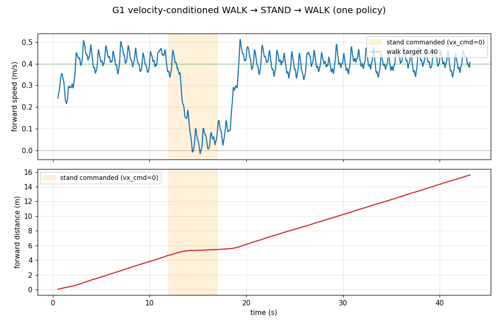

# G1 Walking — the RL journey, root causes, and the retracted distances

> ⛔ **RETRACTED — the long-distance, zero-fall G1 deploy walks this document
> originally headlined DO NOT REPRODUCE (withdrawn 2026-06-19).**
> Those three-figure metre counts over ~10-minute bouts were measured on an **old
> deploy path** (before the silent-XPBD-fallback fix `cbe5e6f0` and the trainer↔deploy
> joint-clamp-parity fix `9b6df709`). On the **current** Newton deploy the
> `gpu_g1_walk26_shape_c8` / human-gait policies **topple in ~1 s**; the real,
> reproducing deploy walk of that era is **finite — `ft_pdoff_clamp` walks +5.9 m /
> 33.8 s then falls**, and a durable ≥80 %-ghost walk is **OPEN**.
> **They were never a shipped result. Do not quote them as one.** This document is
> kept as a *historical journal of the root-cause discoveries* (which stand); its
> distance claims are recorded only as claims that were made and withdrawn.
> Canonical status: [rl-current-state.md](rl-current-state.md); current recipe:
> [g1-deploy-walk.md](g1-deploy-walk.md).

Status as claimed on 2026-06-11 (end of day): *"G1 walks with a HUMAN GAIT — tall IK
stance, 60/40 timing, arm swing — for hundreds of metres with ZERO falls in the
OmniSim Newton deploy, in real time, reload-safe."* ⛔ **That headline was retracted
eight days later** (banner above). What survived the retraction is the **recipe and
the five root causes** below — the gait model, the stiffness-match rule, the launch
phase, the ONNX clamp, the constraint-buffer plumbing. What did not survive is the
durability.

| variant | policy | launch | deploy result **as reported at the time** |
|---|---|---|---|
| full body, HUMAN GAIT (`-Arms` default of that era) | `runs/gpu_g1_walk18_human_h12` | `run_g1_walk_deploy.ps1 -Arms` | ⛔ **RETRACTED** — multi-hundred-metre zero-fall bouts; unreproducible on the current deploy (topples ~1 s) |
| legs-only, sine CPG (13-DOF) | `runs/gpu_g1_walk15_c12` | `scripts/dev/run_g1_walk_deploy.ps1` | ⚠️ old-path figure (+25.9 m/68.5 s zero falls) — **not re-verified** on the current deploy |
| full body, sine CPG + arm swing | `runs/gpu_g1_walk17_natural_n6` | (superseded by human gait) | ⚠️ old-path figure (+9.5 m) — **not re-verified** |
| GUI (real-time paced) | same | `run_g1_walk_deploy_gui.ps1 [-Arms]` | ran at 1.0x wall clock (pacing only — not a durability claim) |

The road here contained five distinct root-cause discoveries, each of which
invalidated a previously-believed diagnosis. They are worth recording because
every one of them is a *class* of bug, not a one-off — and because the last one
(the retraction itself) is the biggest.

## 1. The 20× joint-stiffness sim2deploy mismatch (the big one)

Eleven tuning runs (gait shape, sway, rewards, capture-point both signs,
training length) all plateaued at ~1.7 s walks, and the diagnosis on file was
"robust walking needs closed-loop WBC; the 6 cm foot is the wall". That was
wrong. The trainer MJCF (`g1_legs.mjcf.xml`) carried actuator gains
**kp=20/kv=3** from a Newton dump that predated the deploy scripts raising
`OMNISIM_NEWTON_TARGET_KE/KD` to 400/60. At kp=20 a stance hip cannot hold
single support (~20 Nm gravity moment → ~1 rad sag): lateral balance was
physically unlearnable *in the trainer itself* (walk5, no-DR eval: all 1024
envs fall at ~1.3 s). No ±40 % DR covers a 20× error.

**Rule: before training, dump the deploy model (`OMNISIM_NEWTON_SAVE_MJCF`)
and diff actuator gains against the trainer MJCF.** The committed
stiffness-matched models are `g1_legs_kp100.mjcf.xml` and
`g1_full_kp100.mjcf.xml` (kp=100/kv=5 ↔ `TARGET_KE=100/KD=5`, ground μ=2).
The stiffness value is a free choice; *matching* is what matters.

## 2. The walk15 recipe (what actually trains a walker)

Architecture: open-loop CPG gait reference + 13-DOF residual policy
(±0.3 rad), obs 50 (stand's 48 + gait phase sin/cos), PPO on mujoco_warp at
~50 k env-steps/s (`gpu_mjwarp_g1_walk_trainer.py`).

- **Gait reference**: hip 0.35 / knee 0.45 / **ankle counter-rotation 0.35**
  (without it the rigid ankle fights ground rollover and the CPG drifts
  *backward*) / lateral sway 0.05 (the old 0.22 sway was compensating kp=20
  undershoot; at matched stiffness it knocks the robot over), 1.3 Hz,
  start phase 0 (gait ≡ NOMINAL at phase 0 → no target snap).
- **Reset = mid-stride** (`--seed-gait-pose`: q *and* qd on the reference at
  the sampled phase) + `--dr-init-vx-bias 0.4` so episodes practise
  *sustaining* the walk, not just launching.
- **Foot-aware rewards** (`--rw-sched -5 --rw-slip -0.5`, via `mw_d.xpos`):
  stance foot down, swing foot lifted, no skating.
- **`--vel-l1 -0.3`**: the gaussian velocity reward is flat-zero beyond
  |vx−target|≈0.6 — observed failure: the policy "ran away" at 1.7 m/s with
  *no* velocity gradient at all. The L1 term supplies one everywhere.
- **Entropy anneal** (`--ent-coef 0.001 --log-std-clamp -1.5`): at the
  default 0.01 the learned noise *grows* to σ≈0.43 (±0.13 rad on every joint
  every tick) and destabilises rollouts.
- **Gentle DR** (mass .10 / friction .20 / kp .15 / push 0.5): the heavy
  stand-DR profile blocks early learning entirely.
- **Chunked warm-starts** (400 iters × 4096 envs ≈ 8 min each), episodes
  12 s → 30 s. Chunk ladder (mean first-fall steps):
  63→65→88→169→480→738→803→1163→1355→2038→regress→**2282**. Chunks *can*
  regress (PPO oscillation) — keep-best applies, and a **final chunk at
  lr=1e-4** delivered the largest single jump.
- Fixed en route: the `act_rate` smoothness penalty compared `action_t` to
  itself (buffer overwritten before the read) — silently zero in every prior
  run.

Trainer-side eval (1024 envs, no-DR, 40 s): 36.5 s mean first-fall, 14.3 m
mean / 15.4 m median, 0.39 m/s.

## 3. Deploy details that are part of the policy contract

- The trainer's analytic ankle-PD baseline (G1_TRAIN_BAL_* defaults,
  kp −1.5 / kd −0.2, clamp 0.2) is inside the policy's training baseline →
  the deploy must enable it (`G1_BAL_KP_P=-1.5 …`). Defaulting these to 0 in
  the controller was a silent train/deploy gap.
- **Engine matters**: the same policy walks 25.9 m on mjwarp (`MJWARP=1`)
  vs 6.6 m on CPU mj_step. The engines measurably differ (bare-CPG survival
  0.78 s in batched mjwarp vs 1.9 s in plain mujoco, identical model;
  njmax/nconmax ruled out). Deploy on the engine you trained on.
- Gait params are env-configurable (`G1_GAIT_*`, `G1_ACT_SCALE`,
  `G1_START_PHASE`) — one controller deploys any walk policy, and
  auto-detects arm motors (full-body worlds) to pin them at the trainer's
  `ARM_NOMINAL`.

## 4. Realtime: the bridge was sync/launch-bound, not solver-bound

Deploy ran at 0.08× realtime. Profiling (the controller now logs
`rtf=/sim%=/ctrl%=` every sim second) showed 99 % of wall time inside
`robot.step()`; per 16 ms tick ≈ 63 ms fixed bridge overhead + 32 ms per
substep, almost all GPU↔CPU syncs and kernel-launch overhead at nworld=1.
Fixes (commits c57645af, 8aaf5ae4, 78e555c4): per-step `joint_q` readback
cache (13 position sensors paid 13 full GPU syncs/tick), host mirrors for
control writes, dirty-flag-gated newton→MuJoCo state copy-in (only after
external state writes; mutation sites set `_mjc_dirty`), base-guard reads
doubling as the readback caches, **skip newton's per-substep `collide()`**
under MuJoCo contacts (the solver ignores it; it cost ~25 ms/substep;
`get_contacts()` refills lazily; `OMNISIM_NEWTON_KEEP_COLLIDE=1` restores),
and **CUDA-graph replay of the clean-tick substep loop** (the trainer's
trick). Result: **0.08× → 4.8–7.5× realtime**; the GUI paces at 1.0×
(`headless_runner.py --realtime`).

## 5. World reload silently dropped robots to ODE (pre-existing)

Ctrl+Shift+R made the walker "fall at its first step" — actually an
*explosion on ODE physics*: the Newton backend is a process singleton, and
`~WbSimulationWorld` never told it the world was gone. `running` stayed
true, the reloaded world's registrations were silently rejected, robots fell
back to ODE, and the orphaned Newton world kept stepping invisibly. Fix:
`WbNewtonBackend::teardownWorld()` called from the world destructor.
Regression harness: `G1_RELOAD_AT_S=<s>` + `G1_RELOAD_FLAG_FILE=<path>` on
the walk controller reloads mid-walk headlessly. Triage gotcha that burned
an hour: with wall-clock-limited runs, slow configs may never *reach* the
reload trigger — verify the trigger fired before trusting a bisect verdict.

## 6. Full body (arms): trainer parity ≠ deploy parity

Warm-starting the legs champion onto the full-body model with `--hold-arms`
(arms pinned at `ARM_NOMINAL`, +6.1 kg passive load) reached statistical
parity with the legs-only policy in-trainer after 2 chunks (14.4 m vs
14.3 m) — but deployed at only 4–8 m. Eliminated: self-collision (mjwarp
ncon=8 steady), masses (URDF↔MJCF exact), mapping/gains (per-joint dump).
Cause: the deploy's *spawn handover* (straight-leg fold + arm snap) is
out-of-distribution. One chunk of gentle handover DR
(`--dr-init-tilt-band 0.05 --dr-init-vel-band 0.1`) fixed the deploy
(9.3 m / 47.3 m) while *reading worse* in the clean trainer eval.
**Select policies by deploy samples, not trainer eval.**

## 7. The HUMAN GAIT model (the naturalness fix — and four more root causes)

The sine-CPG gait looked robotic because it *is* robotic: joint-space
sinusoids. `projects/policies/control/gait/g1_human_gait.py` replaces it with a gait
planned in **foot space** and realized through closed-form 2-link leg IK:
stance foot translating under the pelvis at exactly −vx, quintic swing arc
with zero-velocity touchdown, 60/40 stance/swing duty with double support,
an **inverted-pendulum pelvis arc** (highest at mid-stance — this is what
extends the stance knee to 0.22 rad, the tall human silhouette, vs the old
0.52 crouch), lateral weight shift, counter-phase arm swing with soft
elbows, and a stride ramp that grows the walk out of the model's own
standing pose. Kinematics are numerically calibrated against the
deploy-matched MJCF (IK→FK 0.00 mm) and the module self-tests
(`python g1_human_gait.py`). Trainer: `--gait-model human`; deploy:
`G1_GAIT_MODEL=human`.

Training it (h1–h12 warm-start ladder, ~240 M steps) reproduced the
familiar pattern — *trainer walks, deploy dies at 1.9 s* — and closing that
gap surfaced FOUR more root causes (commit f4c04f7a):

1. **DS_PHASE launch**: the inherited gait-clock convention put the right
   foot MID-SWING at phase 0, so settles/rest-starts stood on a lifted foot
   and tipped within a second. The clock now starts in double support.
2. **Gravity-sag rest-starts**: after the deploy settle, kp=100 joints hold
   NOMINAL with a τ/kp steady-state error (knees +0.15–0.18 rad — visible
   by diffing the deploy's obs against the trainer's, the single most
   useful diagnostic of the whole effort). Trainer rest-starts now sample
   the sagged band so the real launch pose is in-distribution.
3. **tanh→clamp ONNX export**: training squashes actions with
   `clamp(−1,1)`; the export wrapped tanh — weakening every mid-range
   action by up to 24 % (tanh(1.0)=0.76). Latent since the stand trainer;
   saturated bang-bang policies masked it. Re-export tool:
   `projects/policies/research/training/reexport_onnx_clamp.py`.
4. **Deploy njmax/nconmax never plumbed**: newton auto-estimated the
   mujoco_warp constraint buffers too small; hard full-stride footstrikes
   overflowed → dropped contacts → mid-walk numerical explosions
   (bz → thousands of meters). The trainer fixed this same class long ago
   with `G1_NJMAX=256`; the bridge now defaults
   `OMNISIM_NEWTON_NJMAX/NCONMAX=256` (including the seed rebuild).

After the fixes, the deploy was reported to **exceed** the trainer eval (hundreds of
metres vs ~15 m median in-trainer) — the conclusion drawn was that the launch had been
the entire bottleneck. ⛔ The deploy distance in that comparison is **retracted**
(banner at the top); the *qualitative* lesson — **select policies by deploy samples,
not by trainer reward** — survives, and is the one to carry forward.

## 8. Gait-parameter optimization (formal pass over GaitParams)

`projects/policies/research/training/optimize_gait_params.py` evaluates candidate
parameter sets with the shipped policy in the batched GPU env, scoring
**survival**, **cost of transport** (positive mechanical power / m·g·v —
the standard legged-locomotion optimality metric; torque reconstructed
from the kp/kv actuator model) and **velocity tracking**. 19 candidates
(one-at-a-time coordinates + composites) around the shipped operating
point. Findings:

- **The shipped point is a survival local-optimum.** Most moves hurt;
  the best single moves were vx 0.35 (+8 % survival, −20 % CoT, slower)
  and x0 −0.03 (par survival, −21 % CoT, best tracking).
- **The model's structural choices are load-bearing**, not cosmetic:
  flattening the pelvis arc (bob 0.020→0.014) or shortening stance
  (duty 0.60→0.57) collapse survival 3–4× (25 s → 8 s / 5.7 s) — direct
  empirical validation of the inverted-pendulum arc and the human duty
  factor.
- **Improvements do not compose under a fixed policy** (composites gained
  economy but lost survival — trust-region behaviour), and a fine-tune
  chunk at the best economy point (h13) did not beat the champion, so
  h12 ships unchanged. Caveat: this is optimization under the trained
  policy, i.e. a local search around its training point by construction.

The path to *globally* optimal/maximally natural remains motion-capture
imitation (AMP-style: retargeted human walking clips + a discriminator
reward replacing the hand-built reference) — specified as future work.

## 9. Measured human kinematics (the "winter" gait style)

The planner+IK reference (§7) walks far but its knee is a single smooth
bend — recognizably non-human. `g1_human_gait.py` gained a second style,
`"winter"`: the **Winter normative joint-angle curves** (the standard
biomechanics dataset of human hip/knee/ankle sagittal kinematics over the
gait cycle) digitized as keyframe tables and driven directly as the joint
reference. This adds the two visual signatures a foot-space planner cannot
produce: the **knee double-bend** (near-straight heel strike, ~18°
weight-acceptance flex, re-extension, ~60° swing flex) and the **ankle
push-off** (plantarflexion kick at toe-off). Trainer `--gait-style winter`
/ deploy `G1_GAIT_STYLE=winter`. Calibration gotcha: the ankle curve must
be normalized about its **stance-phase mean** (not full-cycle mean) or
mid-stance carries a ~0.13 rad dorsiflexion bias — a permanent shank lean
that tips every launch regardless of policy.

## 10. The ghost: seeing the model, in 3D, beside the robot

`g1_walk_ghost_demo.wbt` + `run_g1_walk_ghost_demo.ps1`: a second,
**physics-free** G1 walks beside the real robot playing the *pure* gait
model — no RL, no balance — phase-locked to the real robot's forward
progress. The visible gap between them IS the RL correction + tracking
error. Two non-obvious requirements:

- `staticBase TRUE` is **not enough**: the importer still emits Physics on
  every link with `<inertial>` and Newton registers them (the world fell
  back to XPBD and simulated the ghost as a second articulation). The
  ghost needs a **visual-only URDF** with all `<inertial>` + `<collision>`
  stripped (`make_ghost_urdf.py` → `g1_23dof_ghost.urdf`); zero Physics →
  Newton skips it → joints play kinematically via `motor.setPosition()`.
- The hologram look (`G1_GHOST_ALPHA`/`G1_GHOST_TINT`) is applied live by
  the supervisor walking its own subtree and setting every
  `PBRAppearance.transparency`. API traps: proto internals need
  `getProtoField` as well as `getField`, and `Field.getCount()` returns
  **-1, not an exception**, on SF fields — an MF-first walker silently
  skips every `HingeJoint.endPoint` (only 2/29 shapes got hit until fixed).

## 11. Gait STYLE: measure the waveform, reward the swing leg

"Match the ghost" decomposes into two different objectives, and the
distinction is the single most useful lesson of this phase:

- **Per-tick pose imitation** (`--rw-track`) fights balance — the robot
  must be free to time/lean its stance. It barely moved fidelity and cost
  deploy robustness (8–11 m vs 57 m).
- **Gait style** = the stride *waveform*. `measure_gait_style.py` (trainer)
  and `analyze_deploy_style.py` (deploy trace via `G1_TRACE_REF`) bin
  joints by gait phase and compare to the model with circular alignment:
  amplitude ratio, shape correlation, phase lag. Phase lag is invisible to
  the eye; **amplitude muting is what reads as robotic** (w5: knee at
  0.25× the model's size, shape corr 0.8 — right moves, whispered).
  Measure style **in deploy**: deploy style is far better than trainer
  style (soft-joint undershoot partly self-corrects under real contact).

The fix that worked: `--rw-swing-track` — posture imitation **only on the
unloaded swing leg** (hip pitch + knee, weighted by the model's swing
weights). The swing leg carries no balance duty, so style there is free.
Result (t5): knee 0.79×/45° in-phase in deploy — more human, and (as measured
at the time) more robust. ⛔ The multi-hundred-metre zero-fall figure reported for
this run is **retracted** (banner at the top): the *style* result stands, the
*durability* result does not. A six-candidate sweep (stronger
weight, ankle term, extra chunks, deploy-only pre-comp ×2, trained
pre-comp ×1) confirmed t5 as the Pareto point of that design; notable
probe: over-commanding the hip reference +27 % in deploy-only tracked the
ghost at corr 0.95–0.99 (near-perfect style is *mechanically reachable*)
but fell at 74 s — out-of-distribution for the policy.

## 12. Lessons from Boston Dynamics + Disney, and the shipped v3

Research pass (BD electric Atlas: RL tracking retargeted human mocap at
cloud-GPU scale; Disney BDX, RSS 2024 / arXiv 2501.05204: imitation-led
reward with survival 20 ≥ leg-pos imitation 15 ≫ task terms, joint-
*velocity* tracking, early termination, heavy DR, ~100k iterations).
Trainer gained the full recipe: `--rw-track-vel` (reference joint
velocities by finite difference), `--track-et` (deviation early-
termination counts as a fall), `--track-et-grace` (**must exceed the
launch ramp** — with 1.5 s grace every rest-start died at grace expiry
and the launch was unlearnable; fell at exactly 1.0 s).

Empirical verdict at our scale: imitation-dominant + ET (m1–m4, 800-iter
warm chunks) reaches style corr 0.96–0.99 while upright but **always
falls in deploy** (1–16 s) — that recipe needs Disney-scale from-scratch
training, not retrofit chunks. (Metric trap: a fallen robot air-tracks
the reference perfectly with its unloaded legs — cut the style trace at
the first `FALL@` or corr 0.99 is fake.)

**What shipped instead — v3** (`gpu_g1_walk23_style_v3`): **trained hip
pre-compensation**. Train *and* deploy with the reference hip arc scaled
1.2× (`--gait-hip-scale 0.9` / `G1_GAIT_HIP_SCALE=0.9`; the ghost stays
nominal), so the soft joints' undershoot lands the *achieved* motion on
the ideal; the swing-leg style reward keeps the rest. Deploy style vs the
nominal model: **hip 0.80× (was 0.64×), knee 0.72×/41° in phase, weakest
joint 0.64→0.72**. ⛔ The multi-hundred-metre zero-fall distances reported for v3
and its sibling v2 — at the time called "the project's distance record" — are
**retracted** on the same grounds as the rest of this document (banner at the top):
old deploy path, unreproducible. The *style* numbers (the hip/knee ratios above)
were measured in the trainer and stand. All three launch scripts set the matched
`G1_GAIT_HIP_SCALE`; deploy without it is a sim2deploy gap by definition.

## 13. Policy architecture, memory, and the long-run sizing math

### The architecture (what the policy actually is)

- **Observation (50-dim)**: lin vel (3) + ang vel (3) + projected gravity
  (3) + joint q − NOMINAL (13) + joint qd (13) + last action (13) + gait
  phase sin/cos (2). The phase obs is what lets the policy phase-lock to
  the reference.
- **Action (13-dim)**: a *residual* around the gait-model baseline,
  `targets = clamp(baseline + 0.3·action, joint_limits)`. This interface —
  not the layer sizes — is the most load-bearing architectural choice in
  the project (≈40× sample efficiency over raw joint targets).
- **Network**: MLP 256→128, tanh, separate value head, learned per-joint
  log-std (init −1.0 so the residual starts near zero and the analytic
  baseline carries day 1). Disney BDX uses 3×512 ELU for the same task
  class; ours is smaller-but-normal for locomotion.

**"Is the architecture optimal?" is unanswerable; "is it the bottleneck?"
is testable, and the answer is no**, on three pieces of evidence: (1) the
+27 % pre-comp probe made this exact network track the ghost at corr
0.95–0.99 — it can *express* the target behaviour; (2) all observed
failures are experience-shaped (fine in state A, falls in unvisited state
B), not representation-shaped (uniformly unable to fit); (3) trainer
reward saturates — the net fits what it is asked to fit.

### Memory (frame-stacking) — probe, implementation, A/B

**Probe formula** (`probe_memory_signal.py`): on a logged deploy trace,
ridge-regress the next-tick achieved joint position
`q[t+1] ~ W·[features] + b`, comparing features
A = `[q[t], qd[t], cmd[t]]` (present only) against
B = `[q[t−3..t], qd[t−3..t], cmd[t−3..t]]` (history K=4), 70/30 time
split, per joint. If B beats A, the actuator lag carries learnable
structure a memoryless policy cannot see. **Result: history improves
next-tick prediction 16–36 % (hip +16–23, knee +26–27, ankle +26–36 —
largest exactly at the over-flapping joint).**

**Implementation** (`--obs-stack K` / deploy `G1_OBS_STACK=K`): env keeps
a per-env ring buffer of the last K obs, **newest first**, refilled with
the fresh obs on episode reset (no cross-episode leakage); nets and PPO
buffers sized `OBS_DIM·K`; ONNX exports the wide input; the deploy
controller stacks in the identical order. Ordering and K are part of the
sim2deploy contract.

**A/B test** (from scratch, identical recipe/budget/dr-seed, 1200 iters
= 59 M env-steps, only variable = memory): stack-4 led the learning curve
at **every** checkpoint (reward/step +1.9→+4.0 % at it 100/300/600/900/
1200) and edged eval distance (0.62 vs 0.50 m) at equal training cost.
Modest but consistent, and physics-backed by the probe → **obs-stack 4 is
in the long-run architecture**. True recurrence (GRU + BPTT) is the
escalation only if stacking saturates — it requires a training-loop
rewrite and wasn't needed to capture the lag signal.

### Reference lookahead (the "forecast" obs) — research, implementation, A/B

Field check: conditioning the policy on **future reference targets** is the
standard technique in imitation locomotion (state-of-the-art humanoid
imitation feeds target poses at ~4 future timesteps up to 1 s ahead;
memory architectures beyond stacking show mixed evidence — one study found
plain feedforward + DR beat LSTM on real robots, while TCN/causal
transformers are used at much larger scale). Our advantage: the gait
reference is deterministic, so the "forecast" is **exact**, not learned.

Implementation (`--obs-lookahead "0.1,0.4"` / deploy `G1_OBS_LOOKAHEAD`):
appends `targets(phase + ω·dt, t_since + dt) − NOMINAL` per lookahead,
**after** the frame stack (the future of past frames is redundant). It is
real information during the launch ramp (`t_since` is not otherwise
observable) and a capacity shortcut afterwards (the net no longer has to
decode the Winter tables from phase sin/cos).

Three-arm A/B (from scratch, identical recipe/budget/dr-seed, 1200 iters
= 59 M steps):

| arm | reward/step @1200 | eval fwd dist | first-fall step |
|---|---|---|---|
| no memory | +2.684 | 0.50 m | 132 |
| stack-4 | +2.727 | 0.62 m | 110 |
| **stack-4 + lookahead** | **+2.742** | **0.79 m** | **135** |

The lookahead arm starts slower (more inputs to organize), catches up by
it 600, and finishes best on every metric — +58 % eval distance over the
memoryless baseline. **Long-run architecture: obs-stack 4 + lookahead
[0.1, 0.4] + 3×512.**

### Human motor control as an architecture audit (and the asymmetric-critic test)

Mapping our policy onto the neuroscience of human locomotion — which is
*hierarchical*: a spinal **CPG** generates the rhythm, **reflexes** gate
off the gait phase, the **cerebellum** runs forward models to predict
ahead, and the **basal ganglia** learn value from privileged internal
signals — shows we had independently built most of it:

| human motor system | our component | status |
|---|---|---|
| spinal CPG | gait reference + phase obs | have |
| phase-gated reflex | balance PD | have |
| cerebellar forward model | lookahead obs | have (just added) |
| minimal-intervention / passive dynamics | residual action | have |
| muscle synergies (low-dim control) | — | emerges unforced (Nature 2024) |
| basal-ganglia privileged value learning | symmetric critic | **tested below** |

The one missing piece — privileged value learning — became the
**asymmetric actor-critic** (`--asym-critic`): the critic sees base height
+ foot contacts/heights (sim-only, hidden from the 13-DOF actor), the
actor and exported ONNX unchanged (verified 226-wide, critic discarded at
deploy → zero deploy risk). **A/B verdict at 59 M steps: a wash.** It led
the reward curve early (better value estimates bootstrap faster: +1.98 vs
+1.93 at it 100, clearly ahead at it 600) but converged to +2.740 — tied
with lookahead (+2.742) — and eval distance was 0.60 m, *below* lookahead's
0.79 m. **Why, and the useful conclusion:** our DR is a single shared
randomized model (no per-env hidden physics to disambiguate — the classic
asymmetric win), and the actor is already well-observed (base velocities,
joint q/qd, lookahead), so privileged critic info is largely redundant.
That the actor doesn't *need* the privileged signal is itself a validation
that the observation design is good. Implemented and committed (deploy-
safe, available to re-test at 1 B scale where the early-curve lead could
compound) but **not adopted by default** — the architecture stays lean.

**Net architecture conclusion:** the human-motor-control-inspired stack is
essentially complete and A/B-validated. The remaining lever is training
*scale*, not more architecture. Final long-run net: **frame-stack 4 +
lookahead [0.1, 0.4] + 3×512**.

### Machine throughput + long-run hours (measured, RTX 5070 Ti Laptop 12 GB)

- 4096 envs: **~53 k env-steps/s sustained** (≈191 M steps/hour).
- 6144 envs: ~50 k/s (no gain — GPU saturated); 8192 envs: **OOM**.
  4096 is this machine's operating point; no config knob buys more.
- Sizing anchors: every shipped policy carries ~200–250 M steps of ladder
  heritage; the A/B showed **59 M steps from scratch is still
  pre-walking** — walking emerges past ~200 M; DeepMimic-class imitation
  needs ~1–2 B.

| plan | env-steps | wall (pure) | wall (with chunk evals) |
|---|---|---|---|
| minimum credible | 300 M | 1.6 h | ~2 h |
| **recommended from-scratch run** | **1 B** | **5.2 h** | **~6 h** |
| full Disney-equivalent | 2 B | 10.5 h | ~12 h |

### The long-run spec (pending)

From scratch: imitation-primacy reward at Disney ratios (survival ≥ leg
imitation ≫ task terms), joint-velocity imitation, deviation-ET with
launch-safe grace (> ramp), gentle DR ramp, **obs-stack 4**, **3×512
net**, ~1 B steps as ~15 self-checkpointing chunks with deploy-style +
zero-falls evaluation per chunk, keep-best. Run on an idle GPU (a
concurrent sim costs ~25 % throughput).

## Known limitations / next steps

- Walking speed is fixed at the trained 0.4 m/s straight-line command;
  velocity/heading commands (steering) are the natural next capability.
- Style ceiling of the current stack: hip 0.80×/knee 0.72× of the human
  model. The two frontier movers, in order: a **Disney-scale from-scratch
  run** with the §12 imitation-primacy recipe (thousands of iterations —
  the corr-0.99 destination exists, m-branch proved it), and the **kp200
  stiffness campaign** (zero-residual tracking floor 8.0°→5.9°, shrinks
  the undershoot pre-compensation works around; `g1_full_kp200.mjcf.xml`
  staged).
- AMP (discriminator on retargeted mocap windows) remains the
  research-grade endgame for naturalness.
- Run-to-run deploy variance still exists below the h12 level for weaker
  checkpoints; select by deploy samples, never trainer eval.
- Startup flake (rare, under heavy concurrent sim load): newton FFI smoke
  fails with `[Errno 9]` → whole process on ODE. Logged by the existing
  warning; unfixed.
- The trainer is CPU-launch-bound (~50 k steps/s, one Python thread);
  `--envs 8192` fits in GPU memory and is the next throughput lever.

## 14. Holistic shape reward, the leg-spread fix, and the drunk-gait diagnosis

This is the arc from "match specific joints" to "match the silhouette" to
the realization that the gait itself is built wrong.

### 14.1 Holistic shape reward — shape-c8 shipped
User insight: stop matching specific joint angles; match the ghost's
**silhouette** and let the robot find a balanced way to hit it. `--rw-shape`
forward-kinematics the swing leg's hip/knee/ankle to the sagittal **knee +
toe** Cartesian positions (constants from `g1_human_gait`, `LF=0.14`) and
pays one `exp(-dist/sigma)` over the shape; the toe keypoint pins foot
orientation → kills the ankle over-drive without a per-joint ankle term.
8-chunk run warm from c16 → **`gpu_g1_walk26_shape_c8`**: deploy hip 0.78 /
knee 0.90 / ankle 1.04 — **balanced on all (sagittal) joints** vs the field
(v3 0.80/0.72/1.32, c16 0.61/0.94/1.23, both lopsided). ⛔ The long-distance
zero-fall figure reported for c8 is **retracted** — on the current Newton deploy
this exact policy **topples in ~1 s** (banner at the top). It became the `-Arms`
default of that era (`83e4aab8`/`c73bb5de`). One gotcha: the
sagittal-only reward left lateral balance free → a deterministic ~1.3 s
launch ROLL-over in deploy, fixed with a deploy-side roll gain
`G1_BAL_KP_R=-3.0` (no retrain).

### 14.2 The leg-spread blind spot (the metric was lying)
The user saw the robot **splay its legs** while walking. Measured: actual
hip-roll **+23°/−37°** (≈ **25 cm/side**, ~50 cm stance) vs the ghost's
**~0°** (feet under the hips). **My reward AND my metrics were sagittal-only
(side view); the frontal-plane stance width was never measured or rewarded**
— so "balanced gait, matches the ghost" was a perfect *side profile* over a
splayed *front view*. `analyze_deploy_style.py` / `measure_style_chunk.py`
now report stance width.

### 14.3 3D shape reward — works, but a hard stance↔robustness trade
Extended the FK to **3D**: hip roll rotates the leg about the forward axis →
lateral `y = -z·sin(roll)`. `--rw-shape-lat` matches the lateral knee+toe
position of **both** legs (NOT swing-weighted — the splay is a stance
problem) to the model. Committed `67cf9fbc`. It **works**: stance narrows to
8–33 cm in-trainer and **11 cm in deploy** (`gpu_g1_walk27_lat_c*`). But
narrowing trades robustness — a hard, physical relationship:

| deploy stance | walks (⛔ old-path figures — see banner; kept only for the *relative* ordering) |
|---|---|
| 11 cm (lat_c4) | falls earliest — ankle 1.76 |
| 33 cm (lat_c1) | falls later — ankle 1.10 |
| 50 cm (c8) | ⛔ was reported as the longest, zero-fall run — **retracted**; this policy topples ~1 s on the current deploy |

⚠️ The absolute distances in the table above are from the **retracted old deploy
path** and are therefore omitted. Only the **monotone trend** — *narrower stance ⇒
falls sooner* — is being claimed here, and it was consistent across the sweep.

The narrower the base, the harder to balance; and the roll-gain crutch that
saved c8 **cannot** rescue the narrow ones (stiff lateral PD over-corrects →
launch fall at kp −4.5/−6.0). The model's near-zero target also over-narrows
(the run pushed to 8 cm); a realistic ~12 cm human width is the sweet spot
(`lat_c4` ≈ that in-trainer). Candidates `lat_c1`/`lat_c4` committed; **c8
stays shipped** (shipping a 3×-less-robust policy to fix the look isn't a win).

### 14.4 The drunk-gait diagnosis — the real missing skill (current frontier)
The user's deeper observation: the robot walks **"like it's drunk" in all
situations** — uncontrolled, reactive catching, not deliberate posture-stable
stepping. **One root cause unifies three symptoms:** the robot **never
learned deliberate lateral WEIGHT TRANSFER** (shifting the COM over the
stance foot before/through each step). Instead it found two cheats our reward
allowed — a **wide base** (= the leg spread) and **reactive catching** (= the
drunk wobble) — and when forced narrow it had neither the base nor the skill
(= the narrow-stance falls). The ghost looks right because its reference
includes the lateral sway (weight shift); the robot doesn't follow that part.
NB: human walking is a *controlled fall* (dynamic), not quasi-static "stop
between steps" — the target is deliberate, weight-transferred, posture-stable
stepping, not stopping.

**Planned fix (in order):**
1. **Architecture — adaptive/state-dependent phase** (§15, building now): the
   gait runs on a *fixed clock*, so the robot must step on the beat whether or
   not it's balanced → structural lurching. Let the policy **modulate its step
   timing** (linger when off-balance, step when ready). Enabler.
2. **Rewards (next):** **COM-over-stance-foot** reward (the key — the literal
   "balance over the stance leg", a soft capture-point/ZMP objective; we have
   foot xpos + COM), **torso angular-velocity penalty** (kill the wobble),
   **bigger lateral sway** (visible weight rock), **more double-support / a
   touch slower cadence** (time to be deliberate). The driver that exploits the
   adaptive phase.

## 15. Stop in the middle: a velocity-conditioned single policy

The milestone the user asked for: **command the robot to stand in the middle
while it is walking — just stand — then continue walking again.** A "pause"
button for the gait.

### 15.1 Why not two policies
First instinct was a two-policy mode machine (a walk policy + the Newton-robust
stand policy, blended by a schedule). It loads and runs, but the **walk→stand
transition falls** (pitches forward at ~10 s): shrinking the stride and blending
to a stand policy **cannot arrest forward momentum**. Stopping a gait is a
*capture-point* problem — you have to plant a foot ahead of the COM to brake —
and neither separately-trained policy ever learned that stopping step. A
hand-off between two policies that never trained the transition is fragile by
construction.

### 15.2 The right shape: one policy, commandable speed
The standard locomotion answer is a **velocity-conditioned** policy: add a
forward-speed command (including 0 = stand) to the observation and reward, and
train across the whole range. Then "stop" is just `vx_cmd → 0` and "go" is
`vx_cmd → 0.4`, handled by *one* policy that naturally decelerates and
re-accelerates — no hand-off, no separate stand. Implementation (all gated on
`--vx-cmd-max 0.45`, warm-started from the shape-c8 walker so it stays
deployable):
- **Trainer:** a per-env `vx_cmd_t`, appended LAST to the obs (`+1` dim;
  warm-start zero-pads the first layer of actor+critic). The gait amplitude,
  swing weights, reference lookahead, and the velocity-tracking reward all
  **scale by** `s = clamp(vx_cmd/vx_target)`, so `vx_cmd=0` collapses the gait
  to the standing pose and the reward asks for zero forward speed.
- **Deploy** (`g1_walk_deploy.py`, `G1_VX_CMD_MAX`): the existing stride scale
  `_w` *is* the normalized command (`vx_cmd = _w·VX_NOMINAL`), so the same
  schedule that decelerated the two-policy version now drives one policy. The
  command is appended to the obs.
- Run driver `vc_run_driver.ps1` (10 chunks, ~80 min); deploy/verify with
  `run_g1_walk_vc_deploy.ps1 [-StandAt 12 -StandFor 5] [-Gui]`,
  `analyze_vc_trace.py`, and `plot_vc_milestone.py`.

### 15.3 The debugging arc (and the bug that cost it)
The milestone *mechanically* worked early — walk, slow on command, resume, no
fall — but with a **0.13 m/s residual creep** during the "stand" (a slow
shuffle, not a true stop). Chasing a clean static stand produced a long arc of
fixes that each broke something else, and one real bug hiding underneath:

- **Gait-clock freeze** (`--vx-phase-freeze` / `G1_VX_PHASE_FREEZE`): couple the
  step frequency to the speed so the phase *freezes* at `vx_cmd=0` (step
  frequency drops with speed, like a real gait). This gives a genuine dead stop
  (deploy trace read −0.001 m/s) — the creep was a **cycling phase driving a
  periodic residual micro-step**. But a frozen launch phase is
  out-of-distribution for the warm-start, and it tipped at launch. *Gated, off
  by default.*
- **Tight stand-sigma** (`--vel-sigma-stand`): sharpen the velocity-tracking
  gaussian at `vx_cmd=0` (the default σ=0.10 is so wide that a 0.13 m/s creep
  still scores 0.84 — almost no gradient to zero). It pushes harder to zero but
  makes the policy **over-actuate the launch-hold stand** → jerky → fall.
  *Gated.*
- **Action-fade to a pure pose** (`G1_VX_STAND_FADE_W`): fade the policy out as
  it stands and hold the statically-stable deep-squat nominal + ankle PD (the
  same pure-pose stand `g1_stand` ships). It **tips in ROLL** — the deep-squat
  *walk* nominal is **not laterally stable without the policy**. The policy is
  doing essential roll balancing; you can't fade it. *Gated off.*

**The real bug:** the deploy freeze knob `G1_VX_PHASE_FREEZE` **defaulted to
0.10 (on)** while the shipped policy trains with the freeze **off**. So the
deploy was freezing the phase at every stand, which is OOD for a no-freeze
policy → it tipped at ~1.3 s. This single **train/deploy mismatch** produced a
whole string of "launch falls" that were misattributed to the tight sigma and
to under-training. With the default fixed to **off** (matching training), the
policy walks +9.9 m and the milestone runs clean. *Deploy-time knobs that shape
the obs MUST match training — diff them first.* (Same lesson as the kp20↔kp400
stiffness mismatch in §0, in a new costume.)

### 15.4 What actually ships
A perfectly *static* stand is **unreachable for a policy-based stand** — the
policy is the balance controller, so a small residual creep is its irreducible
cost. But the creep **tightens with training** (the decelerate-to-stand
transitions get practiced on the low-lr chunks: c4 = 0.093 → c9/c10 = 0.07–0.08
m/s), which is a genuine *stop and go*: an 83 % speed reduction to a near-stand,
then a clean resume. Two more findings made it robust:
- **Concentrate the speed sampling** on the two speeds that matter —
  `_sample_vx_cmd` = 30 % at `vx_target` + 28 % at 0 + 42 % uniform. A flat
  `uniform[0,0.45]` dilutes the nominal-walk experience and **erodes the
  warm-started walk robustness** (the first symptom: c1 fell at launch until the
  sampling was concentrated).
- **Launch from walk, not from a stand** (`-LaunchHold 0`, default): stepping
  catches the lateral fall that a launch-hold stand suffered on some chunks, and
  it matches the narrative (the robot is *walking*, then stops mid-walk). Launch
  robustness is still chunk-dependent (~half the chunks fall at launch — likely
  the roll-PD finite-diff kick at the first ticks), but the deploy is
  **deterministic**, so we ship one verified-robust chunk.

**`gpu_g1_walk29_vc_c10`.** The *velocity-conditioned transition* was the result:
**walk 0.41 → stand 0.07–0.08 m/s → resume 0.41**, over repeated stop/resume cycles.
⚠️ The accompanying distance/zero-fall durability figure is an **old-deploy-path
number and has NOT been re-verified** (banner at the top) — treat the
walk↔stand↔walk *transition* as the claim here, not the endurance.
`plot_vc_milestone.py` shows it best: forward speed dips to
~0 in the commanded window and the distance curve **flatlines**, then both
resume.

### 15.5 Lessons
- **Stopping a gait is a capture-point problem**, not a stride fade — train it
  (velocity conditioning), don't hand it off between policies.
- **Velocity conditioning is the clean way to get a commandable stand** out of a
  walker — one policy, `vx_cmd` in the obs, gait+reward scaled by it.
- **A deploy knob that shapes the obs must match training.** A default-on freeze
  vs freeze-off training caused days-equivalent of phantom launch falls. Diff
  deploy-vs-train knobs *before* blaming the policy.
- **A policy-based stand cannot be perfectly static** — the policy is the
  balancer; the residual creep is its cost, and it shrinks with training rather
  than going to zero. Three "make it static" fixes all broke launch or lateral
  balance.
- **Concentrate the command distribution** on the operating points you actually
  need; a flat command prior dilutes the skills you care about.

## 16. The improved shadow & the universal-tracker frame (2026-06-15) — **OPEN PROBLEM**

This section is the **current state of the G1 journey** and ends by stating the
open problem explicitly. Companion docs: [`g1-universal-tracker.md`](g1-universal-tracker.md)
(the north-star objective + recipe) and [`g1-improved-shadow.md`](g1-improved-shadow.md)
(the feasible-ghost modes).

### 16.1 The objective crystallized
The maintainer stated the real goal: **a recipe to make G1 follow the ghost almost
perfectly for ANY motion** — i.e. a *universal physics-based motion tracker*
(DeepMimic → AMP → PHC line). Walking is the **test-bed** for the recipe, not the
end. Recipe = 5 ingredients: reference-as-input, motion corpus, tracking reward,
**deploy robustness**, scale. The hard, motion-agnostic blocker is deploy
robustness — so we attacked it on walking.

### 16.2 The shadow was an impossible target; we made it feasible
The shipped champion (walk26) deploys 217 m but tracks the ghost at **13.4° all-leg
— and the whole gap is frontal** (hip-roll 22–36°, hip-yaw 20°): the "drunk splay."
Sagittal is already at the ~6° PD-compliance floor. Root cause: the legacy ghost
commands hip-roll ≈ 0 (= "don't balance"), so the robot *must* splay → an
unmatchable target. Fix = **make the ghost feasible**: three modes in
`g1_human_gait.py` — **A** LIPM weight transfer, **B** distill-from-achieved, **C**
human-3D normative (+ the previously-zero hip-yaw). Visualized + a standalone
self-walking OmniSim shadow demo (`run_g1_shadow_demo.ps1`).

### 16.3 The training arc (walk30 → 33) and the recipe lessons
| run | change | deploy | deploy splay |
|---|---|---|---|
| walk30 | shadow C + frontal-track | **fell @ 6.6 s** | (collapsed) |
| **walk31** | **+ contact-solref DR** | **+131 m / 337 s** | 26.4° |
| walk32 | + residual cap 0.3 | fell @ 10 s | 18.6° |
| walk33 | wider DR 0.65 | fell @ 29 s | 24.8° |

- **DR was per-run, and contact stiffness was never randomized** — only friction.
  Adding `--dr-solref-scale` (contact softness) **crossed the STABILITY half of the
  warp→Newton gap** (walk30's 6.6 s collapse → walk31's 131 m / 337 s). *The
  breakthrough.* Recipe rule: **DR must randomize contact `solref`, not just friction.**
- **Fidelity did not transfer.** walk31 still splays 26.4° in deploy (commanded
  3.8°) — the policy piles residual splay on for balance under Newton's solver.
- Capping the residual (walk32) drops it to 18.6° **but the robot falls** — the
  splay is **load-bearing balance**, not cosmetic drift.
- **Contact-match diagnostic** (`OMNISIM_NEWTON_SAVE_MJCF` dump vs trainer MJCF):
  contact params are **identical** (solref 0.02, default solimp, foot-ground
  friction 2.0 both). So the gap is **solver-implementation** (batched mjwarp vs
  Newton-wrapped mjwarp), not model/parameter.
- **Wider DR** (walk33) was **worse** (fell @ 29 s, splay barely moved) — "too wide
  → mush." walk31's moderate DR was the sweet spot. **DR ceiling reached.**

### 16.4 Where we are now
- **Best deployable shadow-C = walk31** (`gpu_g1_walk31_shadowCdr_c6`): +131 m,
  337 s, lateral-*stable* — genuinely better motion quality than the splayed
  champion, and it survives Newton where walk30 collapsed. **walk26 remains the
  overall distance champion (217 m).**
- **Lateral-fidelity-in-deploy is fully characterized**: every cheap lever is
  exhausted (reward / residual-cap / contact-param-match / wider DR). The deploy
  splay (~26°) is **solver-gated load-bearing balance**.

### 16.5 THE OPEN PROBLEM
> **Deploy fidelity on the frontal plane: make the robot *track the ghost's slim
> lateral motion in Newton* — not merely walk stably with a ~26° splay.**
>
> It is gated by the **warp→Newton solver-implementation gap**, NOT by the model,
> contact parameters, reward, or residual (all ruled out empirically). DR closes
> the *stability* half but has a fidelity ceiling. The only known closer is a
> **Newton fine-tune** (training the final chunks *in* the deploy engine), which is
> expensive (Newton is ~single-world, not 100k-steps/s parallel).
>
> In universal-tracker terms: **ingredient-4 (deploy robustness) is half-solved —
> stability crosses the gap, fidelity does not.** This is the open frontier of the
> G1 journey.

### 16.6 Open directions (priority order)
1. **Goal-conditioning** (the next architectural rung): make the reference a
   *runtime input* (drop the hardcoded gait baseline). Higher leverage toward
   "track *any* motion" than chasing the last degrees of lateral polish.
2. **Newton fine-tune**: the only known fidelity closer — revisit once the
   architecture is universal (so the investment serves all motions, not one gait).
3. **Motion corpus + AMP**: mocap-retargeted "many ghosts" for true generalization.
4. *(deferred)* kp=200 actuators for the last ~2° of the PD-compliance floor.
