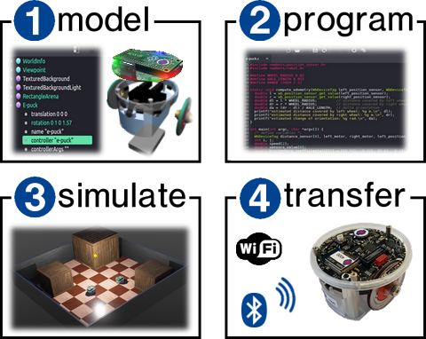

# OmniSim User Guide

OmniSim v7.0.0 — for the authoritative version and release notes, see the root [`CHANGELOG.md`](https://github.com/omnilink-tech/omnisim/blob/main/CHANGELOG.md).

%figure

%end

OmniSim is a robotics simulator built to be driven by AI coding agents. You talk to it; you don't configure it. This user guide walks through installation, the desktop UI, scene authoring, controller programming, sample worlds, and the web/cloud interface.

OmniSim is a fork of Webots. Many pages in this book still reference Webots concepts and APIs — the underlying behaviour generally still applies in OmniSim, since OmniSim inherits the world-file format, controller API, and PROTO system. Pages are progressively being rebranded as the simulator evolves; if you spot a page that describes assumptions no longer true in OmniSim, please update it.

If you are contributing to the simulator itself rather than using it, see the [developer book](../developer/README.md).

Copyright &copy; {{ date.year }} the OmniSim contributors. Inherited content is Copyright &copy; Cyberbotics Ltd. and licensed under the Apache 2.0 license; see [OmniSim License Agreement](omnisim-license-agreement.md).

Permission to use, copy and distribute this documentation for any purpose and without fee is hereby granted in perpetuity, provided that no modifications are performed on this documentation.

The copyright holders make no warranty or condition, either expressed or implied, including but not limited to any implied warranties of merchantability and fitness for a particular purpose, regarding this manual and the associated software.
This manual is provided on an `as-is` basis.
Neither the copyright holders nor any applicable licensor will be liable for any incidental or consequential damages.

The Webots software, from which OmniSim is forked, was initially developed at the Laboratoire de Micro-Informatique (LAMI) of the Swiss Federal Institute of Technology, Lausanne, Switzerland (EPFL).
The EPFL makes no warranties of any kind on this software.
In no event shall the EPFL be liable for incidental or consequential damages of any kind in connection with the use and exploitation of this software.

## Trademark Information

*Aibo*TM is a registered trademark of SONY Corp.

*GeForce*TM is a registered trademark of NVIDIA Corp.

*Khepera*TM and *Koala*TM are registered trademarks of K-Team S.A.

*Linux*TM is a registered trademark of Linus Torvalds.

*macOS*TM is a registered trademark of Apple Inc.

*Mindstorms*TM and *LEGO*TM are registered trademarks of the LEGO group.

*IPR*TM is a registered trademark of Neuronics AG.

*Ubuntu*TM is a registered trademark of Canonical Ltd.

*Visual Studio*TM, *Windows*TM, *Windows XP*TM, *Windows Vista*TM, *Windows 7*TM, *Windows 8*TM and *Windows 10*TM are registered trademarks of Microsoft Corp.

*UNIX*TM is a registered trademark licensed exclusively by X/Open Company, Ltd.
