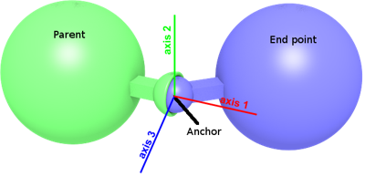

## BallJoint

Derived from [Hinge2Joint](hinge2joint.md).

```
BallJoint {
  SFNode  jointParameters  NULL   # {BallJointParameters, PROTO}
  SFNode  jointParameters2 NULL   # {JointParameters, PROTO}
  SFNode  jointParameters3 NULL   # {JointParameters, PROTO}
  MFNode  device3          [ ]    # {RotationalMotor, PositionSensor, Brake, PROTO}
  # hidden fields
  SFFloat position3        0      # [0, inf)
}
```

> ⚠️ **MOTORISED CONTROL OF THIS JOINT DOES NOT WORK, AND IT FAILS SILENTLY.** Newton/MuJoCo has
> been the only physics backend since ODE was deleted on 2026-08-08 (commit `bdc02139`), and it
> actuates this joint as of 2026-08-17. ⚠️ **This note used to say the opposite** — that the
> constraint registered but the motors were accepted and silently ignored, and that
> `OMNISIM_NEWTON_BALL_HINGE2=1` "does not work either". That was measured against the then-vendored
> newton 1.2.0, whose d6 → MuJoCo actuator mapping for multi-DoF position control was the defect. The
> `b56be84a0` upgrade to **newton 1.5.0** fixed it upstream and the gate now **defaults ON**;
> `OMNISIM_NEWTON_BALL_HINGE2=0` reverts to the old passive constraint. Verified by
> `tests/test_newton_ball_hinge2.py`.
>
> ⚠️ **Still not enforced: per-axis limits.** The ball element reaches MuJoCo with `limited: False`,
> so a [BallJointParameters](balljointparameters.md)' `minStop` / `maxStop` do **not** stop the joint —
> it swings past them. Spring and damping parameters on this joint are likewise not plumbed to Newton.

### Description

%figure "Ball joint"



%end

The [BallJoint](#balljoint) node can be used to model a ball joint.
A ball joint, also called ball-and-socket, prevents translation motion while allowing rotation around its anchor (3 degrees of freedom).
It supports spring and damping parameters which can be used to simulate the elastic deformation of ropes and flexible beams.

Its 3 perpendicular axes can be controlled independently using [RotationalMotors](rotationalmotor.md).
The axes are defined in the [JointParameters](jointparameters.md) nodes in the `jointParameters2` and `jointParameters3` fields (the third axis is computed automatically to be perpendicular to the two first one).
If the `jointParameters2` and/or `jointParameters3` fields are empty, the default axes are used instead (respectively `(1, 0, 0)` and `(0, 0, 1)`).

> **Note**: The `minPosition` and `maxPosition` fields of the [RotationalMotor](rotationalmotor.md) in the `device2` field are constrained to the range [-pi/2; pi/2].

### Field Summary

- `jointParameters`: This field optionally specifies a [BallJointParameters](balljointparameters.md) node.
It contains, among others, the joint position, the axis anchor expressed in relative coordinates and the stop positions.

- `jointParameters2` and `jointParameters3`: These fields optionally specify a [JointParameters](jointparameters.md) node for the second and third axis.
They contain, among others, the joint position, the axis position expressed in relative coordinates and the stop positions.
If these fields are empty, the `springConstant`, `dampingConstant` and `staticFriction` used are those of the first axis defined in the [BallJointParameters](balljointparameters.md) node from the `jointParameters` field.

- `device3`: this field optionally specifies a [RotationalMotor](rotationalmotor.md), an angular [PositionSensor](positionsensor.md) and/or a [Brake](brake.md) device for the third axis.
If no motor is specified, the corresponding axis is passive.

### Hidden Field Summary

- `position3`: This field is not visible from the Scene Tree, see [joint's hidden position field](joint.md#joints-hidden-position-fields).
