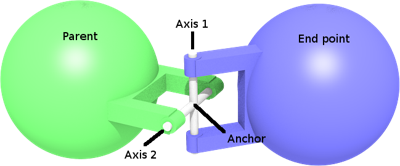

## Hinge2Joint

Derived from [HingeJoint](hingejoint.md).

```
Hinge2Joint {
  SFNode  jointParameters  NULL   # {HingeJointParameters, PROTO}
  SFNode  jointParameters2 NULL   # {JointParameters, PROTO}
  MFNode  device2          [ ]    # {RotationalMotor, PositionSensor, Brake, PROTO}
  # hidden fields
  SFFloat position2        0      # [0, inf)
}
```

> ⚠️ **MOTORISED CONTROL OF THIS JOINT DOES NOT WORK, AND IT FAILS SILENTLY.** Newton/MuJoCo has
> been the only physics backend since ODE was deleted on 2026-08-08 (commit `bdc02139`), and it
> actuates this joint as of 2026-08-17, on **both** axes and independently. ⚠️ **This note used to say
> the opposite** — that the constraint registered but the motors were accepted and silently ignored,
> and that `OMNISIM_NEWTON_BALL_HINGE2=1` "does not work either". That was measured against the
> then-vendored newton 1.2.0, whose d6 → MuJoCo actuator mapping for multi-DoF position control was the
> defect. The `b56be84a0` upgrade to **newton 1.5.0** fixed it upstream and the gate now **defaults
> ON**; `OMNISIM_NEWTON_BALL_HINGE2=0` reverts to the old passive constraint. Verified by
> `tests/test_newton_ball_hinge2.py`, which asserts both axes reach their commanded angle inside
> 0.05 rad and that re-commanding axis 2 does not drag axis 1 with it. Per-axis limits on the two
> hinge elements ARE enforced (unlike [BallJoint](balljoint.md)'s). Spring and damping parameters on
> this joint are still not plumbed to Newton.

### Description

%figure "Hinge 2 joint"



%end

The [Hinge2Joint](#hinge2joint) node can be used to model a hinge2 joint, i.e. a joint allowing only rotational motions around two intersecting axes (2 degrees of freedom).
These axes cross at the `anchor` point and need not to be perpendicular.
⚠️ The suspension fields defined in the [HingeJointParameters](hingejointparameters.md) node of the `jointParameters` field were meant to allow spring and damping effects along the suspension axis, but they are **not read on the current engine** — see the banner on [HingeJointParameters](hingejointparameters.md). Model suspension as a real [SliderJoint](sliderjoint.md) with a motor instead.

Note that a universal joint boils down to a hinge2 joint with orthogonal axes and (default) zero suspension.

Typically, [Hinge2Joint](#hinge2joint) can be used to model a steering wheel with suspension for a car, a shoulder or a hip for a humanoid robot.

> **Note**: A [Hinge2Joint](#hinge2joint) will connect only [Solid](solid.md)s having a [Physics](physics.md) node.
In other words, this joint cannot be statically based.

### Field Summary

- `jointParameters`: This field optionally specifies a [HingeJointParameters](hingejointparameters.md) node.
It contains, among others, the joint position, the axis position expressed in relative coordinates, and the stop positions. (Its suspension parameters and `stopERP`/`stopCFM` are not read — see [HingeJointParameters](hingejointparameters.md).)
If the `jointParameters` field is left empty, default values of the [HingeJointParameters](hingejointparameters.md) node apply.

- `jointParameters2`: This field optionally specifies a [JointParameters](jointparameters.md) node.
It contains, among others, the joint position, the axis position expressed in relative coordinates and the stop positions.
If the `jointParameters2` field is left empty, default values of the [JointParameters](jointparameters.md) node apply.

- `device2`: This field optionally specifies a [RotationalMotor](rotationalmotor.md), an angular [PositionSensor](positionsensor.md) and/or a [Brake](brake.md) device attached to the second axis.
If no motor is specified, this part of the joint is passive.

### Hidden Field Summary

- `position2`: This field is not visible from the Scene Tree, see [joint's hidden position field](joint.md#joints-hidden-position-fields).
