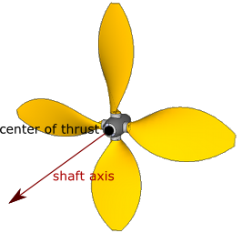

## Propeller

```
Propeller {
  SFVec3f shaftAxis          1 0 0  # unit axis
  SFVec3f centerOfThrust     0 0 0  # any vector
  SFVec2f thrustConstants    1 0    # any vector
  SFVec2f torqueConstants    1 0    # any vector
  SFFloat fastHelixThreshold 75.4   # [0, inf)
  SFNode  device             NULL   # {RotationalMotor, PROTO}
  SFNode  fastHelix          NULL   # {Solid (or derived), PROTO}
  SFNode  slowHelix          NULL   # {Solid (or derived), PROTO}
}
```

### Description

> ⛔ **THIS NODE PRODUCED NO THRUST AT ALL BETWEEN 2026-08-08 AND 2026-08-22, ON EVERY WORLD.
> If you are reading a note, a commit message or a benchmark row from that window, it is
> describing an engine in which `Propeller` was inert.** The ODE deletion (`bdc02139`) left
> `OmSolidMerger::mBody` set to `NULL` in its constructor and assigned nowhere, and
> `OmPropeller::prePhysicsStep` gated the whole thrust computation on that handle. The gate
> could therefore never open: no thrust, no reaction torque, and no assignment to
> `mCurrentThrust` / `mCurrentTorque`. Instead the node emitted *"Adds a Physics node to Solid
> ancestors to enable thrust and torque effect."* — **on airframes that declared a `physics`
> node**, so the engine's only diagnostic contradicted the world file and sent readers to fix
> a field that was already correct. Fixed 2026-08-22 by gating on the Solid's **Newton** body
> (`upperSolid()->bodyHandle()`), the same handle `applyExternalForceNewton` resolves a few
> lines below, mirroring what the supervisor's `add_torque` verb already did.
>
> **Two things this page asserted during that window were false, and they are corrected below
> rather than quietly deleted.** (1) *"a Propeller on a Solid with no Newton body now produces
> no thrust at all — check the Solid has a `physics` node and a `boundingObject`"* read as a
> narrow caveat; the outage was **total**, and no amount of correcting `physics` /
> `boundingObject` would have produced a newton of thrust. (2) *"Feedback is the one thing
> that still works here"* was also false: `mCurrentTorque` is assigned inside the block the
> dead gate skipped, so `wb_motor_get_torque_feedback` on a Propeller's motor read `0.0` for
> the same reason every other motor does. It is real again now.
>
> Measured on the fix (OmniBench lane 4, machine `9722d23d12a3`, CPU `mj_step`): probe
> `device.propeller_thrust` went `broken -> works` — a `thrustConstants 0.001 0` rotor at
> 100 rad/s on a 1 kg airframe in a gravity-free world accelerates at **10.000155 m/s²**
> against the analytic **10.0** (ratio 1.0000155). On the shipped
> [propeller.omniworld]({{ url.github_tree }}/projects/samples/devices/worlds/propeller.omniworld),
> all three helicopters sat **motionless at their spawn pose for 15,360 steps (491.5 s of
> simulated time)** under the exact-revert hatch `OMNISIM_NEWTON_NO_EXT_FORCE=1`, and take off
> without it.
>
> ⚠️ **THE INFLOW (SPEED-OF-ADVANCE) TERM IS STILL NOT SIMULATED, so `thrustConstants[1]`
> (*t2*) and `torqueConstants[1]` (*q2*) have NO EFFECT.** That is a separate, unfixed gap:
> the body point-velocity read at the centre of thrust also went with `bdc02139`, so the axial
> inflow speed *V* in the formulae below is **pinned to `0`** — [`OmPropeller.cpp`]({{ url.github_tree }}/src/omnisim/nodes/OmPropeller.cpp) still reads `const double V = 0.0` — and only
> the *omega*<sup>2</sup> term survives: in practice `T = t1 * |omega| * omega` and
> `Q = q1 * |omega| * omega`. A propeller produces its full static thrust at any airspeed and
> never sees the drop-off that *t2* / *q2* model. Measured, now that thrust exists to measure
> (lane 4 `device.propeller_inflow`): a 5 N rotor under a 1 kg airframe falling from 100 m
> held its descent acceleration at **-4.810034 m/s²** while its axial airspeed went from
> **1.11 to 12.30 m/s** — the closed-form constant-thrust value to within 7 parts per million,
> against a **4.81 m/s terminal speed** the declared *t2* predicts.
>
> ⚠️ **`acceleration -1` on the rotor's motor does NOT mean "instant".** A Propeller's rotor is
> not a physical joint — it is driven through `OmMotor::runKinematicControl`, which ramps at
> `min(acceleration, maxTorque)` rad/s² and substitutes **`maxTorque`** when `acceleration` is
> the default `-1`. So `maxTorque 100` is a *one-second* spin-up to 100 rad/s, and because
> thrust goes as *omega*<sup>2</sup> the first second carries almost none. Measured on lane 4's
> rig: omega rose linearly at **99.97 rad/s²** and reached its commanded 100 rad/s at
> **t = 1.196 s** after a command at t = 0.196 s. Raise `maxTorque` (and `acceleration`, which
> is clamped by it) if you need the rotor at speed promptly; `torqueConstants` is what turns
> `maxTorque` into a real torque limit, so a rig declaring `torqueConstants 0 0` can raise it
> freely.

%figure "Propeller axis"



%end

The [Propeller](#propeller) node can be used to model a marine or an aircraft propeller.
When its `device` field is set with a [RotationalMotor](rotationalmotor.md), the propeller turns the motor angular velocity into a thrust and a (resistant) torque.
The resultant thrust is the product of a real number *T* by the unit length shaft axis vector defined in the `shaftAxis` field, with *T* given by the formula:

```
T = t1 * |omega| * omega - t2 * |omega| * V
```

Where *t1* and *t2* are the constants specified in the `thrustConstants` field, *omega* is the motor angular velocity and *V* is the component of the linear velocity of the center of thrust along the shaft axis.
- *t1* somehow represents the volume of fluid moved by the propeller: large helices will have a large *t1* value.
- *t2* roughly represents the friction on the fluid opposing the motion of the propeller: aerodynamic robots evolving in a low viscosity fluid (like air) should have a low *t2* value.

The thrust is applied at the point specified within the `centerOfThrust` field.
The resultant torque is the product of a real number *Q* by the unit length shaft axis vector, with *Q* given by the formula:

```
Q = q1 * |omega| * omega - q2 * |omega| * V
```

Where *q1* and *q2* are the constants specified in the `torqueConstants` field.
The meaning of *q1* and *q2* is pretty similar to the one of *t1* and *t2*.

More details about the above formulae can be found in "Guidance and Control of Ocean Vehicles" from Thor I. Fossen ([ISBN: 9780471941132](https://en.wikipedia.org/wiki/Special:BookSources?isbn=9780471941132)) and "Helicopter Performance, Stability, and Control" from Raymond W. Prouty ([ISBN: 9781575242095](https://en.wikipedia.org/wiki/Special:BookSources?isbn=9781575242095)).

The [propeller.omniworld]({{ url.github_tree }}/projects/samples/devices/worlds/propeller.omniworld) example shows three different helicopters modeled with [Propeller](#propeller) nodes.

### Field Summary

- `shaftAxis`: defines the axis along which the resultant thrust and torque will be exerted, see [this figure](#propeller-axis).

- `centerOfThrust`: defines the point where the generated thrust applies, see [this figure](#propeller-axis).

- `thrustConstants` and `torqueConstants`: coefficients used to define the resultant thrust and torque as functions of the motor angular velocity and the linear speed of adavance, see above formulae.

- `fastHelixThreshold`: threshold in `[rad/s]` from which the helix representation is switched from `slowHelix` to` fastHelix`.
The default value equals to 24&pi; `[rad/s]`.

- `device`: this field has to be set with a [RotationalMotor](rotationalmotor.md) in order to control the propeller.

- `fastHelix` and `slowHelix`: if not NULL, these fields must be set with [Solid](solid.md) nodes.
The corresponding [Solid](solid.md) nodes define the graphical representation of the propeller according to its motor's angular velocity omega: if `|omega| > fastHelixThreshold`, only the [Solid](solid.md) defined in `fastHelix` is visible, otherwise only the [Solid](solid.md) defined in `slowHelix` is visible.
