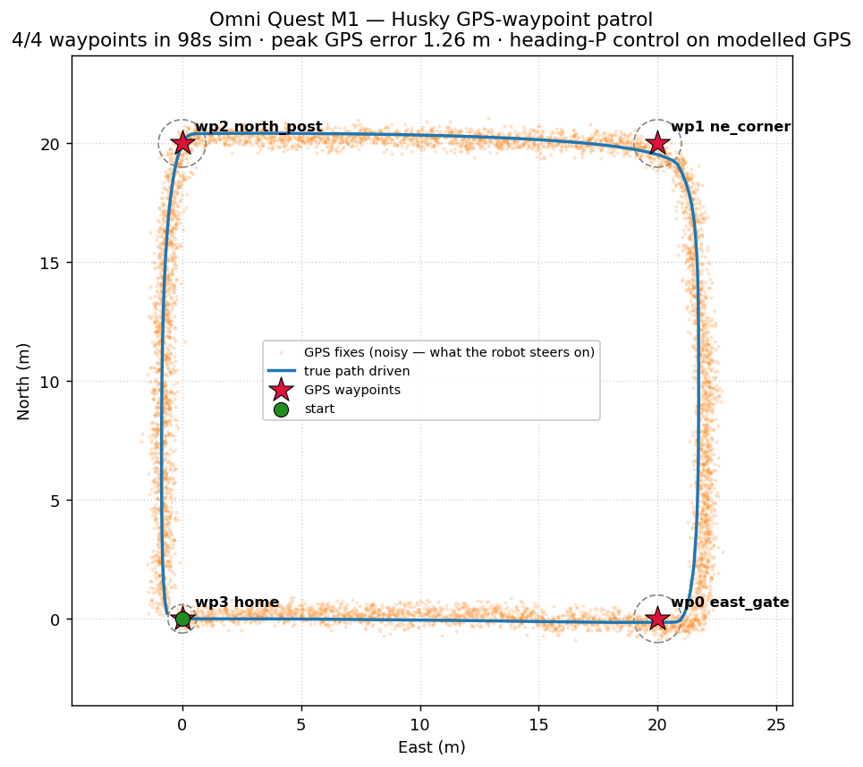
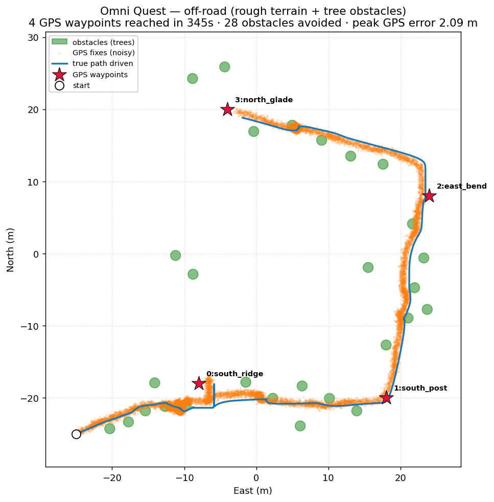
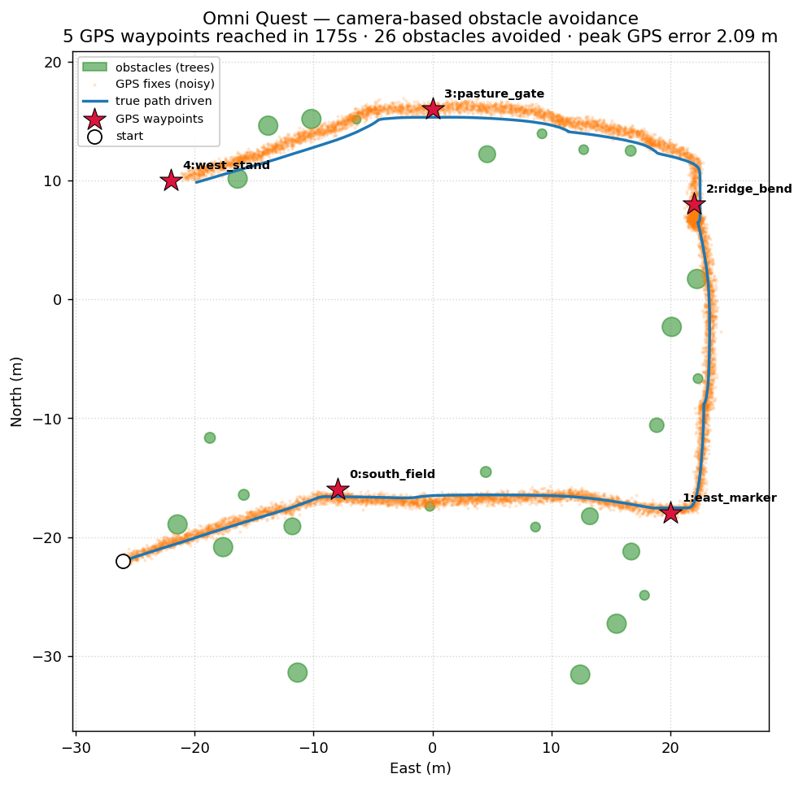

# Omni Quest — outdoor navigation with GPS + cameras

Omni Quest is an OmniSim project for **outdoor mobile-robot navigation**: a
Clearpath Husky drives across open terrain to a sequence of **GPS waypoints**,
using **cameras** for perception and obstacle avoidance. It is built to mirror
the production ROS 2 Nav2 + `robot_localization` architecture for outdoor
ground robots, staged so each milestone is independently runnable.

> **Status — Milestone 1 ✅ (verified).** The Husky completes a 20 m square
> GPS-waypoint patrol navigating only from a noisy GPS fix + heading estimate
> (no ground-truth pose in the control loop). Headless run: 4/4 waypoints in
> 97.9 s sim, peak GPS error 1.26 m. See the roadmap below for M2–M5.



*M1 trajectory (top-down). Blue = true path driven; orange cloud = the noisy GPS
fixes the controller actually steers on; red stars = GPS waypoints with their
reach-tolerance circles. Regenerate with `python tools/plot_trajectory.py`.*

An animated replay of the same run is at
[`docs/m1_run.gif`](docs/m1_run.gif) (`python tools/animate_trajectory.py`).

### Off-road course — **camera-based** obstacle avoidance (M3)

> **Camera obstacle avoidance ✅.** `omni_quest_offroad.omniworld` adds rougher rolling
> Perlin terrain (wheel slip) and a **28-tree obstacle field** seeded *across*
> the route. The Husky avoids the trees using a **real forward camera** — with
> no knowledge of where the trees actually are. A sidecar robot
> (`omni_quest_eye`) snaps onto the Husky each tick, segments tree trunks from
> grass/sky, and writes the obstacle fraction in the Left / Centre / Right of the
> view to `_perception.json`; the nav controller steers toward the clearer side
> (follow-the-gap) and slows as the centre fills. Headless run: 4/4 waypoints in
> 345 s, **camera-steered the whole way**, peak GPS error 2.09 m.



*Off-road trajectory (camera-driven). Green discs = tree obstacles; the blue
true path bows around them. World + obstacle map are generated together by
`python tools/gen_offroad_world.py` — one seeded source, difficulty knobs at the
top (terrain relief/octaves, obstacle count & spacing). Score any run with
`python tools/analyze_run.py` (per-leg timing, path efficiency, closest approach,
GPS error).*

**Why a camera *sidecar*:** device nodes mis-bind when added as children of an
imported `URDFRobot` (the controller binds to the device's name and loses the
robot's wheels), so the camera rides a separate tracking robot — the proven
`husky_eye` pattern. Cameras render fine headless under `--mode=run`.

**Known limitation (from `analyze_run.py`):** the camera version reaches every
waypoint and beats the known-position version on speed *and* path efficiency
(345 s vs 534 s, 86% vs 83%), but still **grazes** trees occasionally (min
clearance dips to ~−0.24 m) — terrain slip pushes it into a trunk before it fully
clears. Next: react earlier (use more of the image / a larger safety bubble). A
**modelled range sensor** (ray-cast vs known discs) stays in the controller as a
`GEO` fallback, for comparison only.

### Populated "living" world

`omni_quest_world.omniworld` is the showcase — a flat grass field densely populated for
a vibrant scene:

* a GPS route threaded through a **mixed obstacle field** (26 trees, rocks,
  barrels, crates, cones — all with collision; the upgraded camera segments them
  as *non-grass* and avoids them all, not just trunks),
* **backdrop structures** — barn, silo, shipping containers, fences,
* a **pasture** of animals (cows, sheep, horse, deer, dog) + sunflowers,
* **three roaming robots** (a Husky + two Jackals) wandering under
  `omni_quest_wander` (auto-detects its drive motors, bounded roam + stuck
  recovery).

The main Husky navigates the whole thing by camera: 5/5 GPS waypoints in 175 s,
**98% path efficiency**, avg 0.70 m/s (flat ground avoids the slip-induced
grazing of the rough off-road course). Generated by `python tools/gen_world.py`.



*Top-down nav path through the obstacle field (this figure shows obstacles +
route; the animals, structures and roaming robots are in the world too). Watch it
live: **File → Open World → `omni_quest_world.omniworld`**.*

### Cross-platform fleet

`omni_quest_fleet.omniworld` proves the navigation algorithm is **platform-agnostic**: a
**Husky and a Jackal run the identical `omni_quest_nav` controller at the same
time**, each with its own camera sidecar, on parallel lanes through a shared
obstacle field. Only the kinematics differ — everything else (GPS waypoint
following + camera obstacle avoidance) is the same code.

Verified (`python tools/verify_world.py`): both **MISSION COMPLETE, 4/4
waypoints**, camera-steered, clear of every obstacle (Husky +0.16 m, Jackal
+0.27 m). Generated by `python tools/gen_fleet.py`.

The controller is parameterised for this:

* `--platform husky|jackal` — kinematics preset (wheel radius / half-track / max
  wheel speed); adding a platform is one dict entry,
* `--id NAME` — per-robot perception / trajectory / log files, so simultaneous
  navigators never clobber each other,
* `--route ATTR` — which route in the course module to follow.

`tools/verify_world.py` reports **every** navigator (one per `_trajectory*.csv`)
and every roamer — the numerical "did they all behave" check, no screenshots.

### Interacting swarm — every robot navigates

`omni_quest_swarm.omniworld` turns the whole fleet into navigators: **four robots
(2 Husky + 2 Jackal) all run `omni_quest_nav`** in two shared lanes of two-way
traffic, so each meets an oncoming robot **head-on** and has to pass it. Two
avoidance layers stack:

* **camera** — each robot sees the oncoming robot as a non-grass obstacle and
  steers around it (plus static obstacles near the lane ends),
* **V2V coordination** (`--coordinate`) — robots share GPS positions; the
  lower-priority one **yields** (stops) when a peer is close ahead, so the pass
  is orderly instead of a reactive scramble.

Verified (`verify_world.py` now also reports robot↔robot closest approach): all
four **MISSION COMPLETE**, clear of the static obstacles, and they pass each
other without a pile-up — closest approaches **0.7–1.4 m** (coordination roughly
doubled the separation vs camera-only; the 0.7 m Husky↔Jackal pass is still a
tight near-graze — a "pull-over" yield would open it up further).

> A *single forward* camera can't solve a **perpendicular** crossing — you can't
> see crossing traffic until it's already in front of you. The swarm sidesteps
> that with head-on lanes + V2V right-of-way.

### Solving the crossing with side cameras

`omni_quest_intersection.omniworld` solves the perpendicular crossing the right way —
**more cameras**. Each robot gets a forward-**right** camera (`omni_quest_eye`
now drives front + side cameras, vision vectorised with **numpy** so perception
stays in lockstep with control). Now a robot sees crossing traffic *before* it's
dead ahead, and a camera-only **"yield to the traffic on your right"** rule
breaks the crossing symmetry with no V2V: the geometry of a perpendicular meeting
always puts the other robot on one robot's right (it yields) and the other's left
(it proceeds).

Verified on a 2-robot crossing (`verify_world.py` reports robot↔robot closest
approach): both **MISSION COMPLETE**, the yield fires, and they **cross without
colliding** — closest approach ~0.7 m, a tight Husky-nose-to-Jackal near-miss
(no overlap). A higher-resolution side camera (earlier detection of a small
robot) or the V2V layer would widen the gap. The 4-way version is the same
mechanism per crossing; it's compute-bound on simultaneous camera renders.

### Testing in the city (real streets + moving traffic)

`tools/gen_city_nav.py` drops a Husky navigator into OmniSim's **city** showcase —
a 4×4 road grid with buildings and **48 cars** circulating under the `city_traffic`
supervisor — and `omni_quest_nav` drives it along the streets by GPS + camera.

The camera runs in **`--road` mode**: grey asphalt / pavement / concrete read as
**drivable (free)**, while coloured buildings and cars read as obstacles — so the
robot follows the road instead of trying to avoid it, and slows for cars it sees
ahead. (Road grid from `city_grid.json`: centrelines at x,y ∈ {−93,−31,31,93},
10 m wide, lanes ±2.6 m; the route drives the eastbound lane of the y=−31 street.)

Verified: **MISSION COMPLETE, 2/2 waypoints in 48 s**, camera-steered, slowing for
traffic en route. Build it with:

```bash
python projects/omni_quest/tools/gen_city_nav.py    # compose city + navigator
bash   projects/omni_quest/tools/setup_city_nav.sh  # make the city_traffic ctrl reachable
# then run worlds/city_husky_nav.wbt
```

`city_husky_nav.wbt` and the copied `city_traffic` controller are **git-ignored** —
they're regenerated from the showcase city, not duplicated in the repo.

## Bridging to the real world

The navigation stack is **native** (not ROS 2 Nav2): a global planner over a
walkable graph + a camera/GPS local planner. To show it runs on *real* data, the
`tools/` carry each piece against a public dataset, and a metric proves the sim
images are statistically close to real — all **camera + GPS only, no lidar**.

* **Real map (`build_osm_map.py`).** Fetches a real street network from
  OpenStreetMap (Overpass), projects it to local ENU, and builds the same
  `CityGraph` the deploy uses. Verified on Manhattan: 707 nodes, and the global
  planner reroutes around a blocked edge exactly as it does in the sim city.
* **Real stereo (`kitti_source.py`).** Reads KITTI raw — synchronized
  `image_02/03` stereo + the rectified calibration (fx 721.5, baseline 0.533 m) —
  and runs the same block-matching depth the sim eye runs. Real frames yield a
  clean ~13.5 m forward-obstacle depth.
* **Real GPS + IMU fusion (`ekf_demo.py`).** A 3-state EKF `[x, y, yaw]` fuses
  odometry speed + gyro yaw-rate, GPS-corrected, on KITTI's real OXTS track:
  **0.68 m mean error**, holding **2.95 m** max drift through a 3 s GPS blackout.
* **Cost-optimal A\* planner (`citygraph.py`).** The global planner is a general
  **A\*** router with a real cost model — distance + a per-leg transfer penalty
  (prefer straight, few-turn routes) + a **crossing penalty** (stepping into a road
  costs extra, so it stays on one sidewalk unless crossing genuinely saves time; a
  distance-only planner crosses gratuitously). A\*'s goal heuristic scales it from
  the 5-node demo to the 707-node Manhattan graph unchanged. Verified offline against
  an independent Dijkstra oracle (`python controllers/omni_quest_nav/citygraph.py`).
* **Global re-planning, for real.** When the camera reports the path blocked, the
  global planner marks that graph edge and A\*'s a detour — deployed in the
  sim city it **arrived at the goal via a 149.6 m reroute** (`AN→BN→G` blocked →
  `AN→AS→BS→BN→G`) staying on the sidewalk; it now gives up on a blocked leg in 5 s
  (was 9 s) so less time is wasted before it reroutes.

### Closing the sim-to-real gap

"Make the sim look real" is meaningless without a number, so `tools/domain_gap.py`
measures one: it compares the sim camera-frame distribution to real (KITTI) across
11 appearance statistics — brightness, contrast, saturation, colourfulness,
edge/texture density, sensor noise, dynamic range, RGB balance — and reports the
distance per feature in pooled standard deviations (median across features; robust
to low-variance outliers). `tools/domain_adapt.py` then closes it by **per-channel
histogram matching** to the real distribution (which aligns brightness, contrast,
dynamic range *and* colour together — a multiplicative exposure tweak compresses
contrast; histogram matching doesn't), a saturation pull, real-camera sensor noise,
and a light unsharp. With `--randomise` it jitters exposure/noise/sharpen/saturation
per frame (domain **randomisation**) so the band *brackets* real instead of matching
one point — the corpus you'd train a transferable perception model on.

| sim frames | mean gap (sd) | what's left |
|---|---|---|
| raw render (128×96) | **26.2** | too bright (151 vs 89), zero sensor noise, no texture |
| + histogram adaptation | **6.7** | brightness/contrast/colour/dynamic-range matched; noise/texture/edge still resolution-bound |
| + 256×192 stereo camera | **4.6** | the three high-frequency gaps collapse — every feature within 3–10 sd of real |
| + per-frame randomisation | **1.7** | the band *brackets* real on all 11 features — the corpus a perception model trains on |

The three high-frequency features (`noise`, `texture`, `edge_density`) are
**resolution-bound** — a render can't carry detail it never drew — so the stereo
camera itself was bumped **128×96 → 256×192**. That collapses them (noise 24→4,
texture 8→3, edge 16→9 sd) and, because the city's cost is dominated by physics +
48 cars rather than the block-matcher, the **live nav still completes**: the Husky
arrives at G in **344 s** (vs 302 s at 128×96), reroutes around the blocked north
walk exactly as before, and stays clear of traffic (closest car 2.68 m). Beyond
256×192 it's diminishing returns against stereo cost. Reproduce with:

```bash
python projects/omni_quest/tools/domain_gap.py     # measure the current gap
python projects/omni_quest/tools/domain_adapt.py   # adapt + re-measure (BEFORE/AFTER)
python projects/omni_quest/tools/domain_adapt.py --randomise   # randomised band
```

KITTI / OSM / captured sim frames live under `_kitti/` (git-ignored, fetched on
demand). Capture fresh sim frames by launching the city world with
`OQ_CAPTURE_DIR` set — the eye sidecar saves its left view there.

## Quick start

Headless (the supported verification path):

```powershell
# From the repo root — point the launcher at the bundled build, run the world.
$env:OMNISIM_HOME="C:\path\to\omnisim"
$env:OMNISIM_LOG_PATH="$env:OMNISIM_HOME\projects\omni_quest\_omnisim_log.txt"
$env:PATH="$env:OMNISIM_HOME\msys64\mingw64\bin;"+$env:PATH
& "$env:OMNISIM_HOME\msys64\mingw64\bin\webots-bin.exe" `
  "$env:OMNISIM_HOME\projects\omni_quest\worlds\omni_quest_waypoints.omniworld" `
  --batch --no-rendering --mode=fast --minimize --stdout --stderr --port=1241
```

The controller mirrors its progress to `_last_run.log` (the OmniSim console is
unreachable headless). Grep it for `REACHED` / `MISSION COMPLETE`.

In the GUI: open `worlds/omni_quest_waypoints.omniworld` from OmniSim
(**File → Open World**) and press play. Four coloured posts mark the route.

Unit-test the geodesy with no simulator at all:

```powershell
python projects\omni_quest\controllers\omni_quest_nav\geo.py   # prints "self-check OK"
```

## How it works

```
        ┌───────────────────────── controllers/omni_quest_nav ─────────────────────────┐
GPS fix │  Sensors.read() ──► local ENU (E, N)  +  heading psi (0 = East, CCW +)        │
+ head. │        │                                                                       │
        │        ▼   heading-P:  psi_d = atan2(Nₜ−N, Eₜ−E);  e = wrap(psi_d − psi)       │
        │   v = V_MAX·max(0,cos e) ;  omega = clamp(K·e)                                 │
        │        │                                                                       │
        │        ▼   skid-steer kinematics ──► four wheel velocities                     │
        └────────────────────────────────────────────────────────────────────────────────┘
```

* **Frame.** Local metric frame is **ENU** (x = East, y = North), matching
  OmniSim R2025a and ROS REP-103. Heading 0 = facing East.
* **Geodesy** (`geo.py`). lat/lon ⇄ ENU via the equirectangular model with
  *local* radii of curvature — accurate to ~cm vs the WGS-84 ellipsoid over a
  campus, and exact on the place-waypoint / read-GPS round trip. A full
  ellipsoid path (`geodetic_to_enu_wgs84`) is included for large areas.
* **Sensor model** (`Sensors`). The controller reads real OmniSim `GPS` /
  `InertialUnit` device nodes **if present**. They don't mount cleanly as
  children of an imported `URDFRobot` (OmniSim mis-binds the controller), so by
  default the GPS is **modelled**: ground-truth pose + Gaussian noise + a slow
  random-walk bias, giving a consumer-GPS-grade fix. The controller consumes
  only that noisy fix, so the navigation problem is identical — and the noise
  is exactly what M2's fusion earns its keep against. Cameras (M3) use a *real*
  rendered OmniSim `Camera` on a `husky_eye`-style sidecar.

See [`docs/RESEARCH.md`](docs/RESEARCH.md) for the full research synthesis
(OmniSim capabilities, OmniLink integration, the Nav2 reference architecture,
and the control/geodesy formulas).

## Roadmap

| Milestone | Goal | State |
|-----------|------|-------|
| **M1** | Drive to GPS waypoints (heading-P, modelled GPS) | ✅ done |
| **M2** | Pure-pursuit control + GPS/IMU/odometry fusion; raise GPS noise | next |
| **M3** | **Camera-based** obstacle avoidance — real forward `Camera` → trunk/free-space segmentation → follow-the-gap ✅ | done |
| **M4** | OmniLink agent layer: NL missions, geotagged capture, Claude vision | |
| **M5** | EKF, varied terrain (forest/desert), heading-init, recovery | |

The build order follows the Nav2 research: get a robot reaching waypoints
first (M1), make the controller credible (M2), add perception (M3), then the
mission/agent layer (M4) and hardening (M5).

## Layout

```
omni_quest/
├── README.md
├── Makefile
├── docs/
│   └── RESEARCH.md                  # wide-research synthesis + formulas
├── worlds/
│   └── omni_quest_waypoints.omniworld     # M1: Husky + grass field + 4 GPS posts
└── controllers/
    └── omni_quest_nav/
        ├── omni_quest_nav.py        # heading-P waypoint controller + Sensors
        ├── geo.py                   # lat/lon ⇄ ENU, bearing, haversine (testable)
        └── Makefile                 # no-op (Python controller)
```

## Notes & conventions

* **Datum.** `WorldInfo.gpsReference` in the world **must** match
  `REF_LAT/REF_LON/REF_ALT` in the controller. The route is authored as ENU
  offsets (`ROUTE_ENU`); the four world posts sit at the same coordinates.
* **Honest navigation.** Ground-truth pose is read only to *score* the run
  (the `gps_err` it logs) — never to steer.
* **Waypoint posts are visual-only** (no `boundingObject`) so the Husky never
  snags on them.
